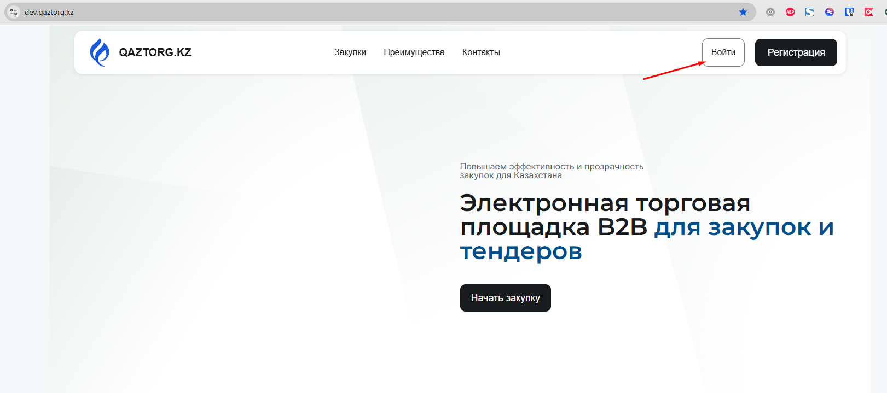
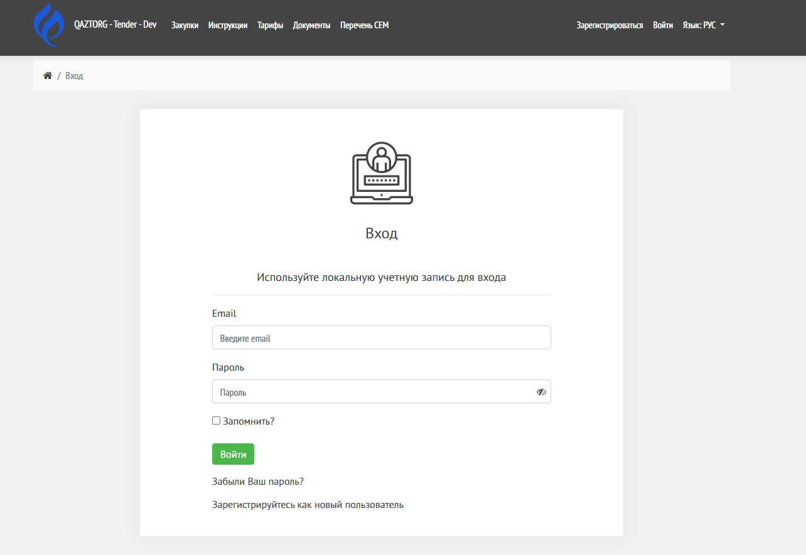

Инструкция по входу в систему электронной торговой площадки (ЭТП).

---

## Когда это нужно

Используйте эту инструкцию, если:

-  вы уже зарегистрированы на ЭТП

-  вам нужно войти в личный кабинет

---

## Видео-инструкция

[video:https://www.youtube.com/watch?v=85u-XSxKcDE&t=20s]

---

## Пошаговая инструкция

### 1\. Откройте страницу входа

Перейдите на главную страницу ЭТП и нажмите кнопку **«Войти»** в верхнем меню.

{width=1621px height=719px}

---

### 2\. Введите учетные данные

Укажите:

-  Email (указанный при регистрации)

-  Пароль

Нажмите на значок 👁, чтобы показать или скрыть пароль

Убедитесь, что пароль введён без ошибок, без пробелов

При необходимости включите «Запомнить»

Если вы используете личное устройство, можно отметить галочку \*\*«Запомнить?»\*\*, чтобы не вводить данные при следующем входе.

{width=1284px height=885px}

---

### 3\. Нажмите «Войти»

После нажатия кнопки **«Войти»** система проверит данные и выполнит вход.

---

## Двухэтапная верификация (если включена)

Подробнее о двухэтапной верификации

Если у вас включена дополнительная защита:

### 1\. Получите код

На ваш email будет отправлен код подтверждения.

---

### 2\. Введите код

Введите код из письма и нажмите **«Войти»**.

---

### 3\. Завершите вход

После подтверждения вы будете авторизованы в системе.

---

## Результат

После входа вы:

-  получаете доступ к функционалу ЭТП

-  Вы можете перейти в [Личный кабинет пользователя](./../../lichnyy-kabinet-polzovatelya/_index)

---

## Возможные ошибки

### Неверный email или пароль

Причина:

-  ошибка при вводе данных

Решение:

-  проверьте правильность ввода

-  проверьте раскладку клавиатуры

-  убедитесь, что не включён Caps Lock

-  Восстановите пароль, если забыли его - [Восстановление пароля](./../vosstanovlenie-parolya)

---

### Пользователь не найден

Причина:

-  аккаунт не зарегистрирован

Решение:

-  [пройдите регистрацию на ЭТП](./../registraciya)

---

## Важно

-  Используйте актуальный email

-  Не передавайте свои данные третьим лицам

-  Рекомендуется использовать современный браузер

## Поддержка

Если не удалось войти в систему:

-  обратитесь в техническую поддержку ([контакты](./../../kontaktnye-dannye-tekhnicheskoy-podderzhki))