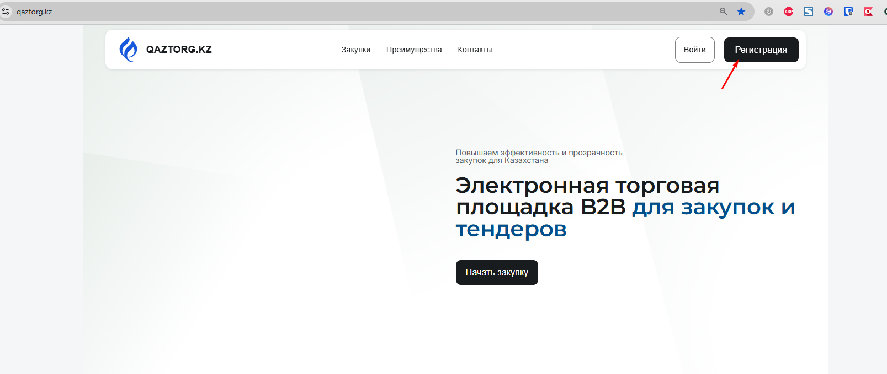
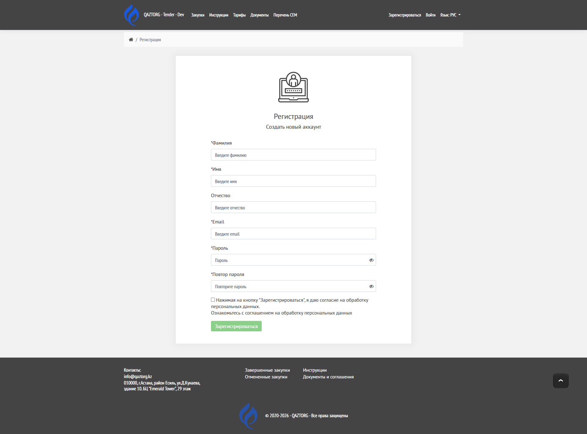
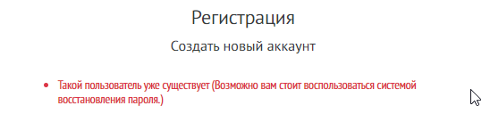

Инструкция по созданию нового аккаунта на портале ЭТП.

---

## Когда это нужно

Регистрация требуется, если:

-  у вас ещё нет учетной записи

-  вы впервые заходите на портал

-  вам необходимо участвовать в закупках

---

## Пошаговая инструкция

### 1\. Откройте страницу регистрации

Перейдите в раздел «Зарегистрироваться»

в верхнем правом углу сайта.

{width=1607px height=679px}

---

### 2\. Заполните личные данные

Введите информацию в следующие поля:

-  **Фамилия, обязательное поле** -- укажите вашу фамилию

-  **Имя, обязательное поле** -- укажите ваше имя

-  **Отчество** -- при наличии

-  В поле **Email**:

   \- введите действующий адрес электронной почты

   \- он будет использоваться для входа и уведомлений

-  В поле **Пароль**:

   \- введите пароль

   \- при необходимости нажмите значок 👁 для отображения

   В поле **Повтор пароля**:

   \- повторите введённый пароль

-  Поставьте галочку:

   \> «Нажимая на кнопку "Зарегистрироваться", я даю согласие на обработку персональных данных»

   Обязательно ознакомьтесь с соглашением на обработку данных по ссылке, нажав на текст - ссылку

   Нажмите кнопку **«Зарегистрироваться»**.

{width=1920px height=1420px}

---

### 6\. Подтвердите регистрацию перейдя по ссылке на почту

После регистрации на указанный Email приходит письмо с ссылкой на регистрацию.

Перейдите по ссылке в письме

---

## Результат

После успешной регистрации:

\- создаётся учетная запись

\- вы сможете войти в систему

\- на email может прийти подтверждение

---

## Возможные ошибки

### Такой пользователь уже существует

Причина: Если указанный Email уже зарегистрирован, отображается сообщение:

*"Такой пользователь уже существует (Возможно вам стоит воспользоваться системой восстановления пароля.)"*

{width=548px height=137px}

### Не заполнены обязательные поля

Решение:

\- заполните все поля, отмеченные \*

\---

### Пароли не совпадают

Решение:

\- введите одинаковые значения в оба поля

\---

### Некорректный email

Решение:

\- проверьте формат email (пример: [name@mail.com](mailto:name@mail.com))

\---

### Не подтверждено согласие

Решение:

\- установите галочку согласия

\---

## Рекомендации

\- Используйте надежный пароль

\- Указывайте рабочий email

\- Сохраняйте данные для входа