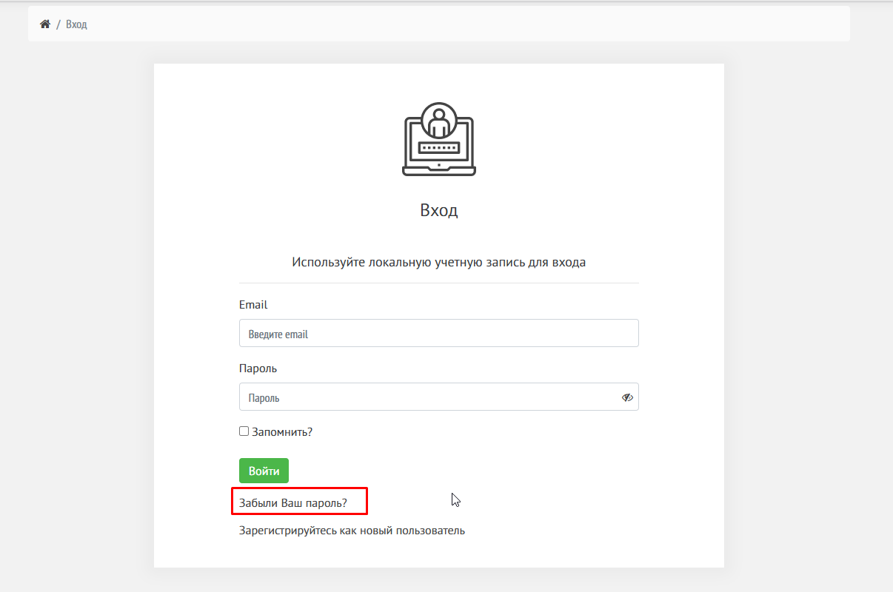
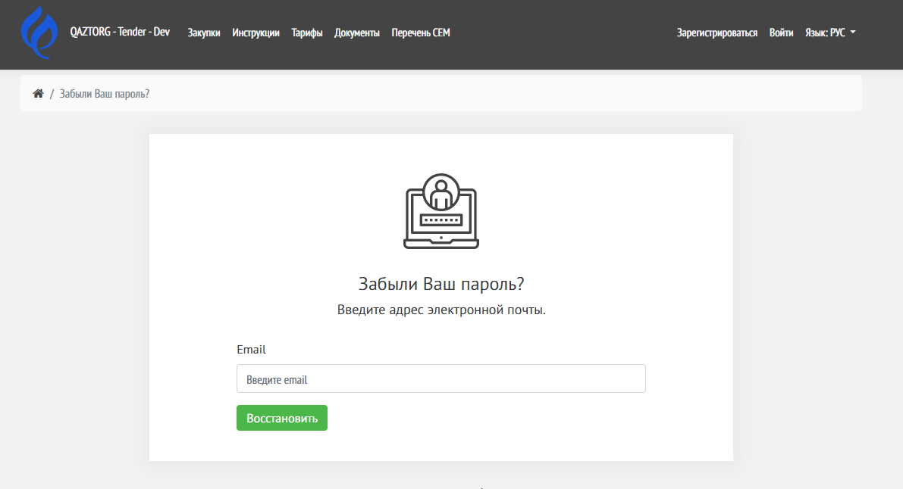
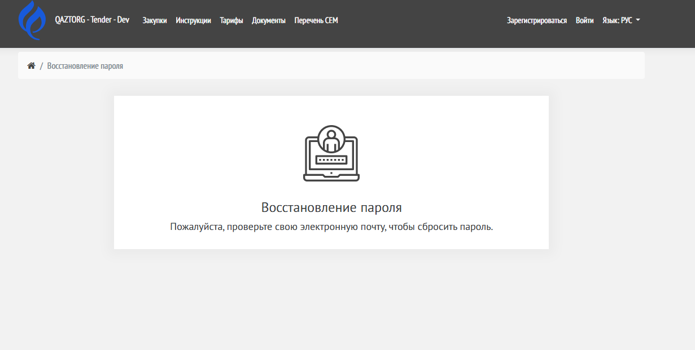
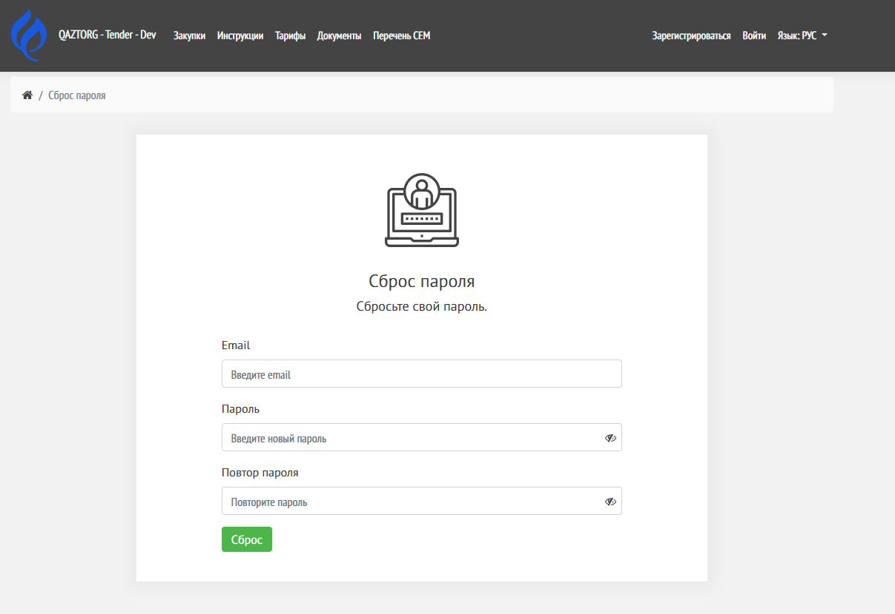

## Когда это нужно

-  Вы забыли пароль

### 1\. Нажмите «Забыли пароль?»

Ссылка находится под формой входа.

{width=1206px height=800px}

---

### 2\. Введите email

Укажите email, который использовали при регистрации.

{width=1191px height=646px}

{width=1231px height=621px}

---

### 3\. Перейдите по ссылке из письма

На почту придёт письмо для сброса пароля с ссылкой.

Перейдите по ссылке.

Откроется окно для сброса пароля.

{width=1207px height=830px}

---

### 4\. Установите новый пароль

В поле **Пароль**:

-  введите новый пароль

-  при необходимости нажмите значок 👁 для отображения

Нажмите кнопку **«Сброс»** для сохранения нового пароля.

---

## Результат

После успешного сброса пароля:

-  откроется страница авторизации

-  пароль будет обновлён

-  вы сможете войти в систему с новыми данными на странице [авторизация](./avtorizaciya-polzovatelya/_index)

---

## Возможные ошибки

### Неверно введен повтор пароля

Причина:

-  введены разные значения

Решение:

-  повторите ввод пароля

---

### Некорректный email (The Email field is not a valid e-mail address.)

Причина:

-  указан email, не связанный с аккаунтом

Решение:

-  проверьте правильность email

---

## Важно

-  Используйте надёжный пароль

-  Не передавайте пароль третьим лицам

-  Сохраняйте пароль в безопасном месте

---

## Поддержка

Если не удалось сбросить пароль обратитесь в [техническую поддержку](./../kontaktnye-dannye-tekhnicheskoy-podderzhki)