Для участия в закупках и публикации объявлений пользователю необходимо добавить организацию в личном кабинете.

---

## Способы добавления организации

Доступно два варианта:

1. Присоединиться к уже зарегистрированной организации

2. Создать новую организацию

---

## Как открыть форму

Если у пользователя не указана организация:

1. Перейдите в профиль (анкета пользователя)

2. В поле **«Организация»** нажмите кнопку **«Добавить организацию»**

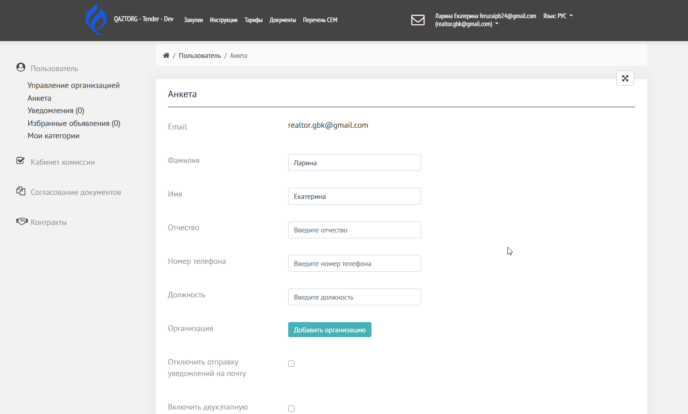{width=1554px height=937px}

После этого откроется форма ввода БИН/ИИН/ИНН.

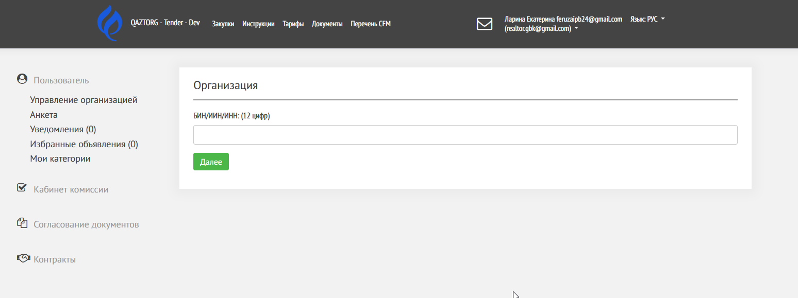{width=1548px height=579px}

---

## Поиск организации

1. Введите **БИН / ИИН / ИНН**

2. Система выполнит поиск

### Если организация найдена

Появится форма заявки на вступление.

Доступная информация:

-  БИН/ИИН/ИНН

-  Полное наименование

-  Юридический адрес

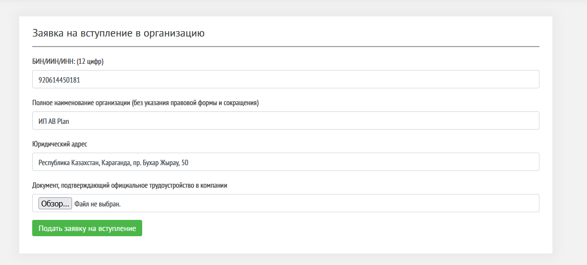{width=1222px height=552px}

### Что нужно сделать

1. Прикрепить документ, подтверждающий трудоустройство

2. Нажать **«Подать заявку на вступление»**

После этого заявка отправляется на рассмотрение.

---

## Создание новой организации

Если организация не найдена, откроется форма создания.

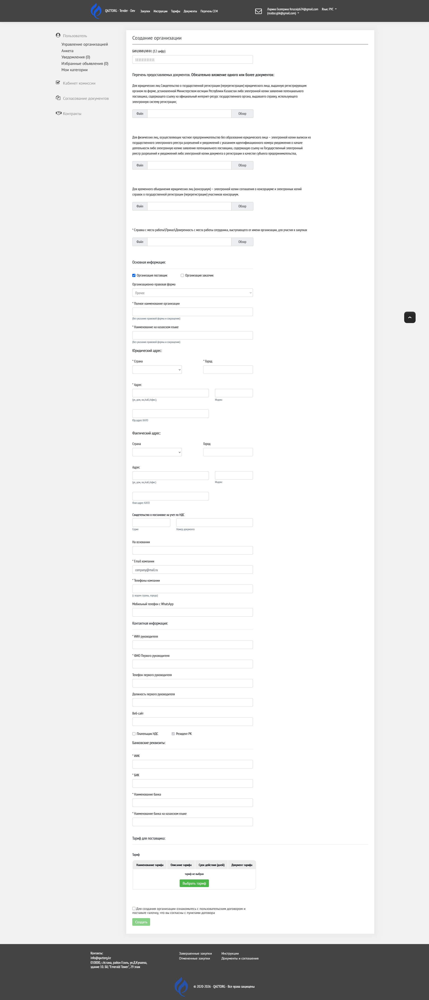{width=1920px height=4470px}

---

## Документы для создания организации

Вам необходимо вложить в одно из полей документы организации в зависимости от типа вашей компании: юридическое лицо, ИП или консорциум

### Для юридических лиц (ЮЛ)

-  Свидетельство о регистрации (или ссылка на гос. ресурс)

### Для ИП

-  Выписка из реестра разрешений\
   или

-  Документ о регистрации

### Для консорциума

-  Соглашение о консорциуме

-  Документы участников

Также обязательно вложить документ, подтверждающий то, что вы работаете в данной организации. 

-  Справка с места работы сотрудника

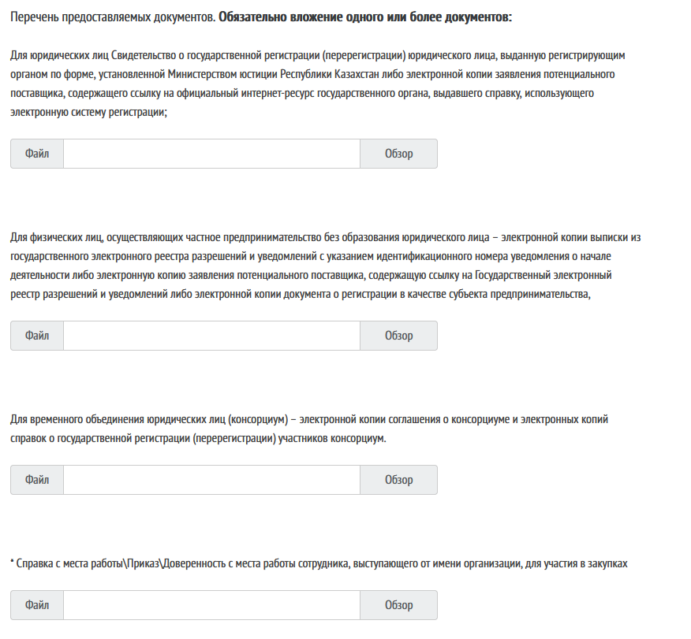{width=876px height=811px}

---

## Заполнение данных организации

Все обязательные поля отмечены звездочкой (\*)

---

### 1\. Основная информация

-  Выбор типа организации на ЭТП 

   -  Организация поставщик - если выступаете как поставщик и участник закупок

   -  Организация заказчик - если выступаете как заказчик и создатель закупок

-  \*Организационно-правовая форма (из списка)

-  \*Полное наименование

-  \*Наименование на казахском языке

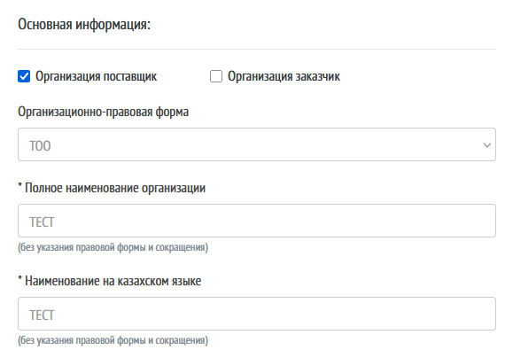{width=579px height=404px}

---

### 2\. Юридический адрес

-  \*Страна (из списка)

-  \*Город

-  \*Адрес

-  Индекс

-  КАТО

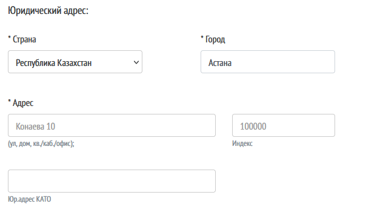{width=632px height=360px}

---

### 3\. Фактический адрес

-  \*Страна

-  \*Город

-  \*Адрес

-  Индекс

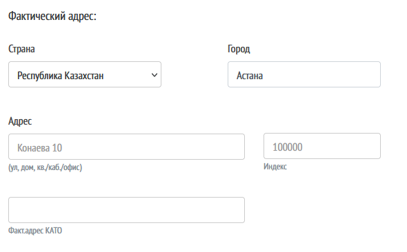{width=590px height=366px}

### 4\. Другие поля

-  Свидетельство о постановке на учет по НДС

   -  Серия

   -  Номер

-  На основании - например, Устава, Свидетельства и т.д.

-  \*Email компании

-  \*Телефон в формате +7 721 27 05 08

-  Мобильный телефон с WhatsApp

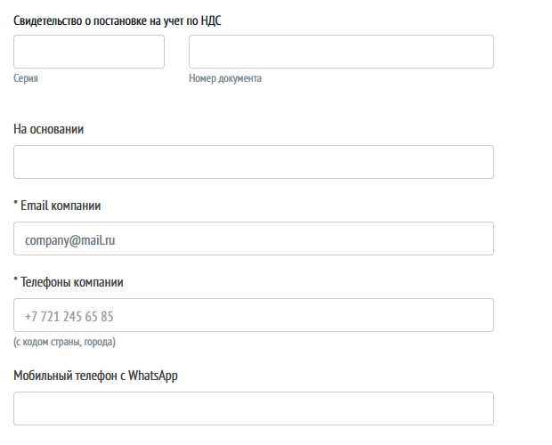{width=620px height=500px}

---

### 5\. Контактная информация

-  \*ИИН руководителя

-  \*ФИО руководителя

-  Телефон первого руководителя

-  Должность первого руководителя

-  Веб-сайт

Отметки:

-  Плательщик НДС - поставить галочку, если да.

-  Резидент РК - если в поле Юр.адрес - Страна указана Республика Казахстан, то галочка проставлена автоматически

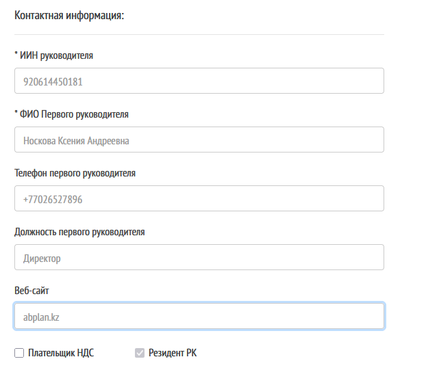{width=622px height=541px}

---

### 5\. Банковские реквизиты

-  ИИК

-  БИК

-  Наименование банка (RU)

-  Наименование банка (KZ)

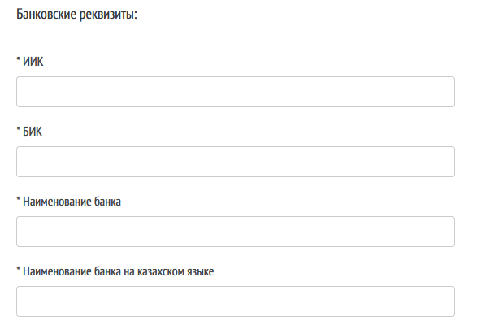{width=619px height=411px}

---

### 6\. Тариф

Выберите тариф для каждого из выбранных типов организации - поставщик или заказчик

Информация о тарифах: Тарифы

---

### 7\. Согласие с договором

Необходимо:

-  ознакомиться с пользовательским договором

-  поставить галочку согласия

---

## Завершение создания

1. Нажмите кнопку **«Создать»**

2. Данные отправляются на проверку администратору

---

## Результат

После проверки:

-  организация будет добавлена

-  пользователь сможет участвовать в закупках

---

## Возможные ошибки

### Заявка отклонена

Убедитесь, что приложены корректные документы

### Не сохраняется форма

Проверьте заполнение обязательных полей

---

## Важно

-  Все данные должны быть достоверными

-  Документы должны быть читаемыми

-  Проверка выполняется администратором ЭТП