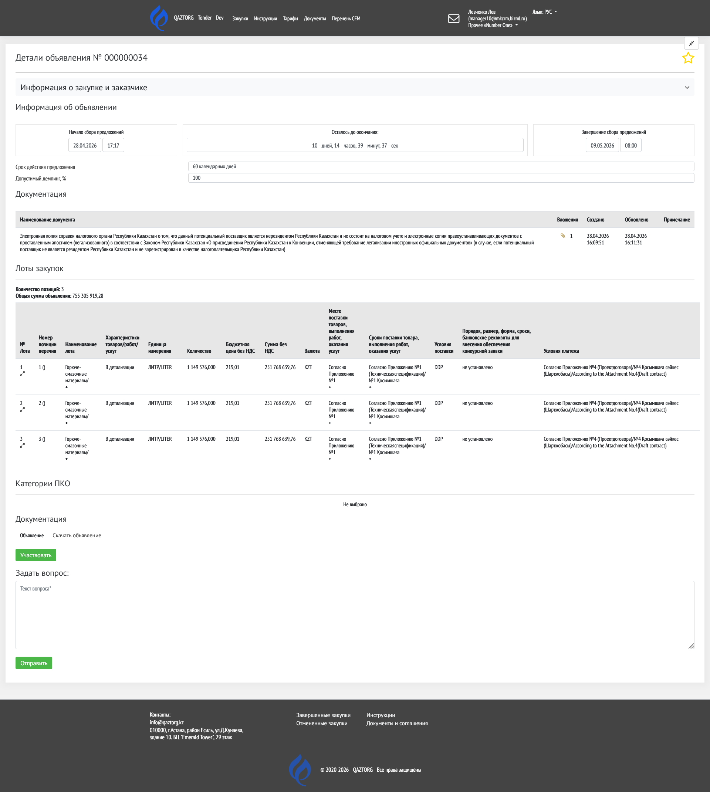
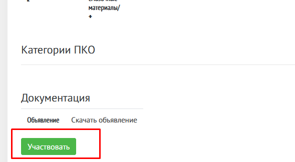

Данная инструкция описывает процесс подачи предложения (оффера) на участие в закупке.

Откройте страницу «Опубликованные закупки»

Затем нажмите на название закупки, в которой хотите принять участие.

{width=1204px height=606px}

Подробнее о странице Объявление написано в статье [Опубликованные закупки](./../zakupki-na-etp/opublikovannye-zakupki)

---

## Условия для участия

Перед подачей предложения необходимо:

-  Зарегистрироваться на платформе

-  Зарегистрировать организацию как поставщика

---

## Начало участия

На странице открытого объявления прокрутите страницу вниз и нажмите на кнопку «Участвовать»

{width=1920px height=2142px}

{width=589px height=324px}