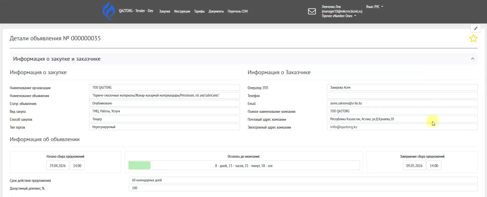
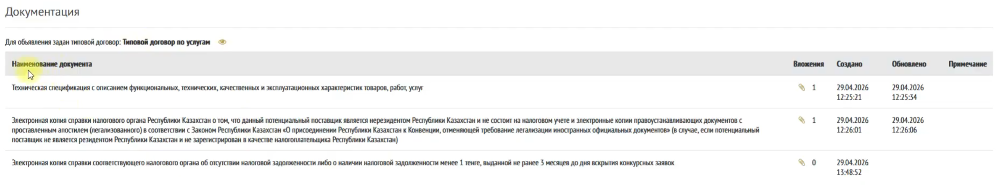
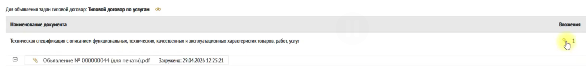

Данная инструкция описывает процесс подачи предложения (оффера) на участие в закупке.

---

## Условия для участия

Перед подачей предложения необходимо:

-  Зарегистрироваться на платформе

-  Зарегистрировать организацию как поставщика

---

## Переход к закупке

1\. Перейдите в раздел **Закупки**

2\. Выберите нужное объявление

3\. Нажмите на его название

{width=1916px height=1139px}

---

##  Ознакомление с объявлением

Перед подачей предложения необходимо изучить:

###  Информация о закупке

-   Вид закупки

-   Контактные данные заказчика

###  Информация об объявлении

-  Даты приема предложений

-   Срок действия

-   Допустимый демпинг

:::quote 

 Если указан демпинг, нельзя подавать цену ниже установленного порога.

:::

{width=2548px height=1032px}

---

##  Документы заказчика

В объявлении доступны:

-   Документы

-   Технические спецификации

-   Типовой договор (если приложен)

{width=2479px height=460px}

Для просмотра нажмите на иконку скрепки.

{width=2069px height=248px}

**Пример просмотра Типовой договор**

{width=2518px height=1061px}

---

##  Лоты закупки

Отображается список лотов:

-   Номер

-   Наименование

-   Количество

-   Цена

Для просмотра деталей:

-   нажмите на лот

{width=2472px height=926px}

В детали лота отображаются дополнительные сведения, а также техническая спецификация по лотам, если она была вложена заказчиком. 

Для просмотра тех.спецификации по лоту нажмите на иконку «скрепка» 

{width=1985px height=410px}

---

## Категория ПКО

Если Заказчик указал категории, по которым будут допущены поставщики с предквалификационным отбором, то они будут перечислены. 

По умолчанию Категории ПКО не выбраны

{width=1376px height=159px}

---

## Документация

На статусе объявления «Опубликовано» отображается подписанный заказчиком документ «Объявление». 

{width=421px height=137px}

---

##  Задать вопрос

Если модуль включен:

1\. Введите текст вопроса

2\. Нажмите **Отправить**

---

\## Начало участия

Нажмите кнопку:

\`\`\`text

Участвовать

Нажмите на название объявления, в котором хотите подать заявку.

{width=1204px height=606px}

{width=1920px height=2142px}

{width=589px height=324px}