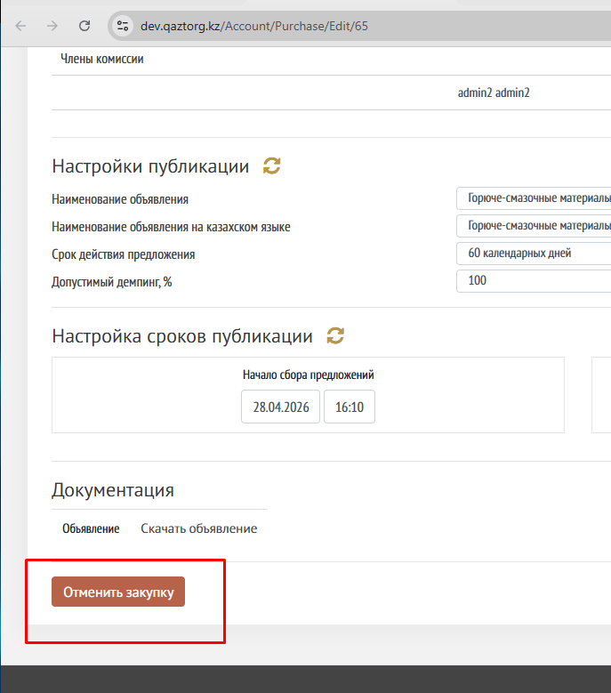
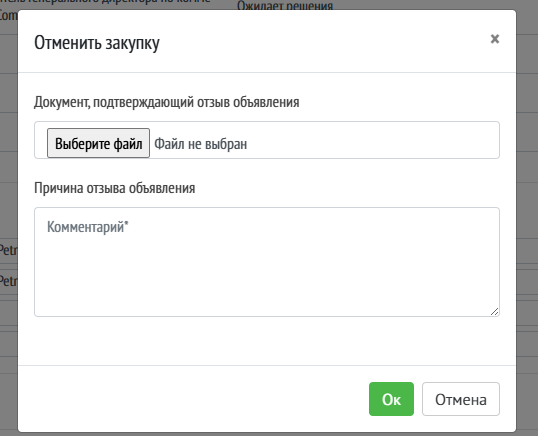
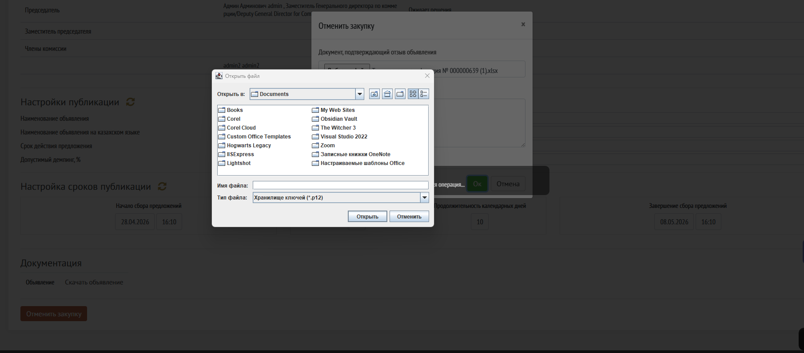
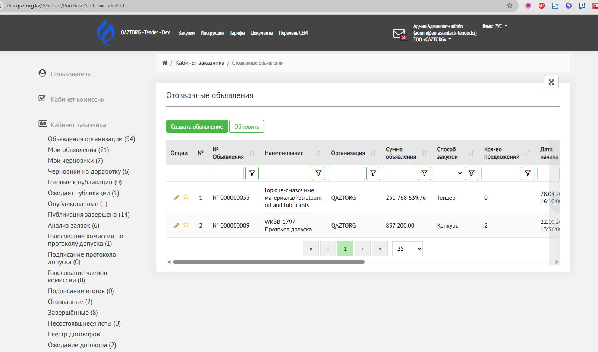
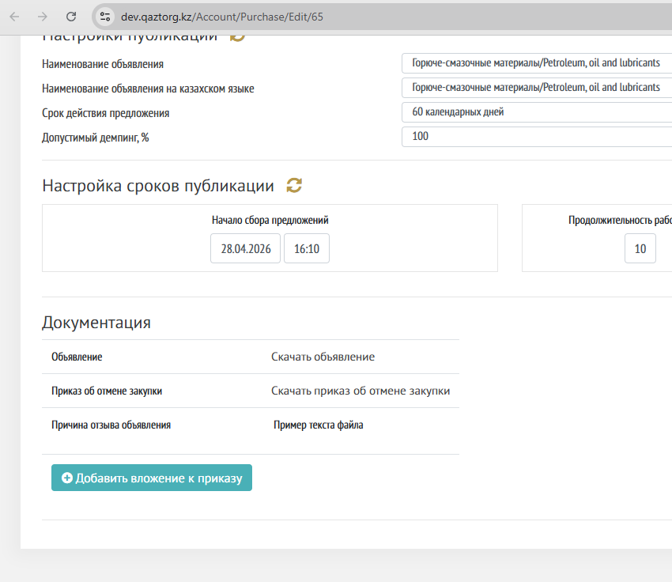
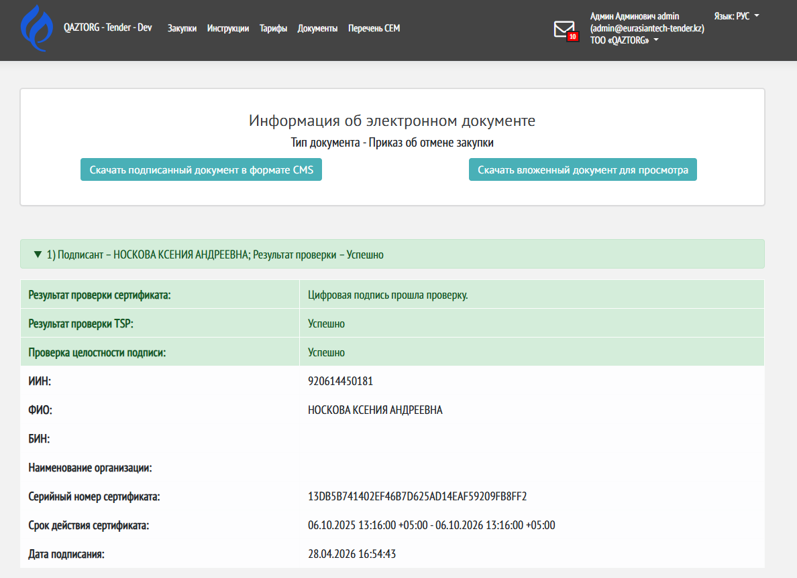

Отмена закупки (отзыв закупки) возможен на статусах: 

-  Опубликовано

-  Анализ заявки

На других статусах отменить закупку невозможно

Для отмены закупки откройте страницу объявления. 

**Важно! Отмена закупки невозвратное действие. Оно завершает закупку и его нельзя будет опубликовать заново!**

{width=687px height=779px}

Если необходимо отменить закупку, нажмите на кнопку «Отменить закупку».

Появится модальное окно для заполнения полей:

-  Документ, подтверждающий отзыв объявления

   -  вложение файла с компьютера,

   -  Нажмите Выбрать файл

   -  Выберите файл на компьютере

-  Причина отзыва объявления

   -  обязательный текстовый комментарий

{width=538px height=436px}

Нажмите кнопку «Ок»

Кнопка «Отмена» отменяет действие.

Файл приказа об отмене закупки необходимо подписать ЭЦП компании.

Откроется окно для подписания ЭЦП через приложение NCALAyer

{width=1810px height=798px}

Статус объявления меняется на «Отозван»

После подписания отмены закупки откроется страница «[Отозванные объявления](./../kabinet-zakazchika/otozvannye-obyavleniya)»

{width=1604px height=945px}

Нажмите на иконку «карандаш», чтобы открыть отмененную закупку. 

Прокрутите вниз до раздела «Документация» 

В разделе документация отображается вложенный и подписанный приказ об отмене закупки и написанный комментарий. 

Данные документы видны всем пользователям системы на странице <https://qaztorg.kz/Home/Canceled>

{width=850px height=736px}

Чтобы скачать приказ нажмите на строку «Скачать приказ об отмене закупки» 

Откроется страница «Информация об электронном документе. Тип документа - Приказ об отмене закупки»

На странице отображается информация о подписанте

Чтобы скачать файл CMS, нажмите на кнопку 1. 

Чтобы скачать просто вложенный приказ для удобного открытия на компьютере, нажмите на кнопку 2. 

{width=1188px height=863px}

## Дополнительная информация 

-  Отмена закупки на статусе Опубликовано и Анализ заявки отличается от отзыва закупки на этапе Ожидает публикации. 

   -  Подробнее об отзыве закупки на статусе Ожидает публикации написано в статье [Ожидает публикации](./provedenie-tendera/ozhidanie-publikacii)