После завершения публикации закупки необходимо провести анализ заявок поставщиков.

Перейдите в раздел Кабинет заказчика, статус «Анализ заявок».

Нажмите на иконку «карандаш» для открытия объявления.

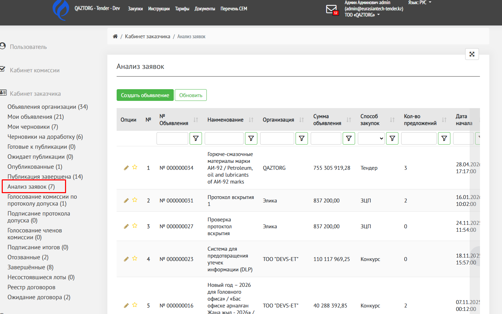{width=1459px height=912px}

---

## Переход к анализу заявок

На странице объявление прокрутите вниз до раздела документация.

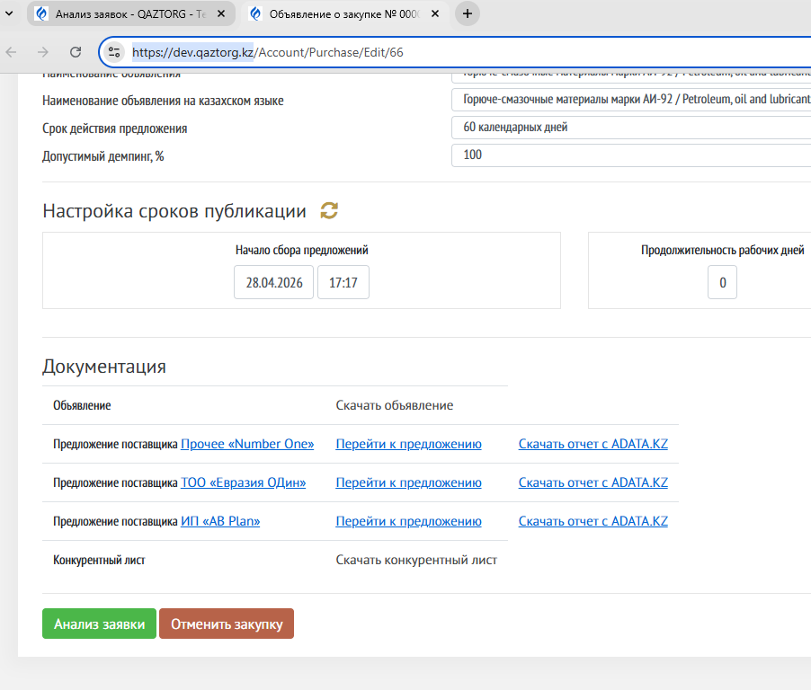{width=902px height=768px}

Нажмите на кнопку «Анализ заявки» для открытия страницы анализа.

---

## Структура страницы «Анализ заявок»

Раскрывающийся раздел Информация о закупке и заказчике

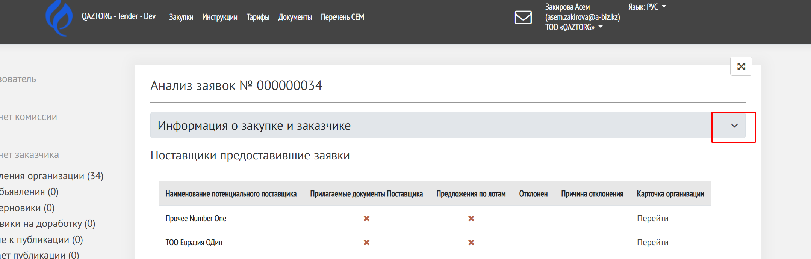{width=2158px height=691px}

---

### Поставщики, предоставившие заявки

Отображается таблица со следующими полями:

-  Наименование поставщика

-  Документы поставщика

-  Предложения по лотам

-  Статус (принят / отклонен)

-  Причина отклонения

-  Карточка организации

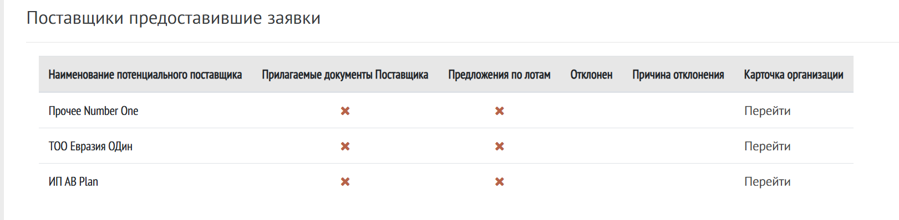{width=1621px height=398px}

Если предложение поставщика еще не проверено, то строка белая, в столбцах красные крестики, означающие, что предложение еще не проверено.

Действия:

-  Нажмите на **наименование поставщика** -- откроется анализ предложения

-  Нажмите **«Перейти»** -- откроется карточка организации

---

## Проведение анализа предложения

1. В таблице поставщиков нажмите на **наименование поставщика**

2. Откроется страница **«Анализ предложения поставщика»**

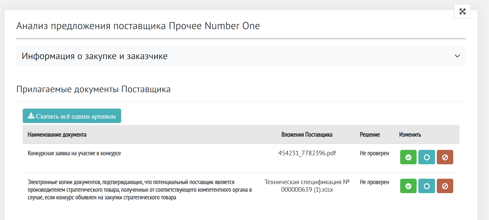{width=1723px height=778px}

---

## Анализ предложения поставщика

### Проверка документов

Для каждого документа необходимо выбрать:

-  Соответствует

-  Не требуется

-  Не соответствует

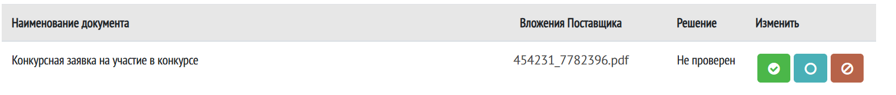{width=1577px height=168px}

-  При нажатии на зеленую иконку проверенный документ окрашивается в зеленый. Статус «Соответствует»

-  При нажатии на синюю - в зеленый. Статус «Не требуется»

-  При нажатии на красную иконку - в красный. Статус «Не соответствует»

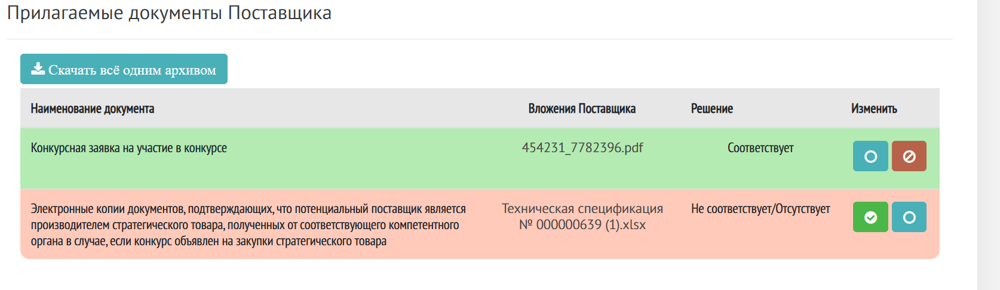{width=1674px height=486px}

Чтобы скачать все вложенные документы поставщика нажмите на кнопку «Скачать все одним архивом».

На компьютер скачивается архив с документами, которые вложил поставщик

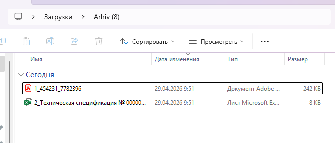{width=666px height=285px}

---

### Проверка предложений по лотам

В разделе отображается информация по каждому лоту:

-  Номер лота

-  Наименование

-  Сумма

-  Статус

Доступна кнопка:

-  **Скачать архив документов по лотам**

   -  При нажатии на нее скачиваются документы, которые прикреплены к лотам предложения

   -  Если вложенных документов нет, то архив будет пустым.

---

### Переход к анализу лота

Нажмите на **наименование лота** для детального анализа

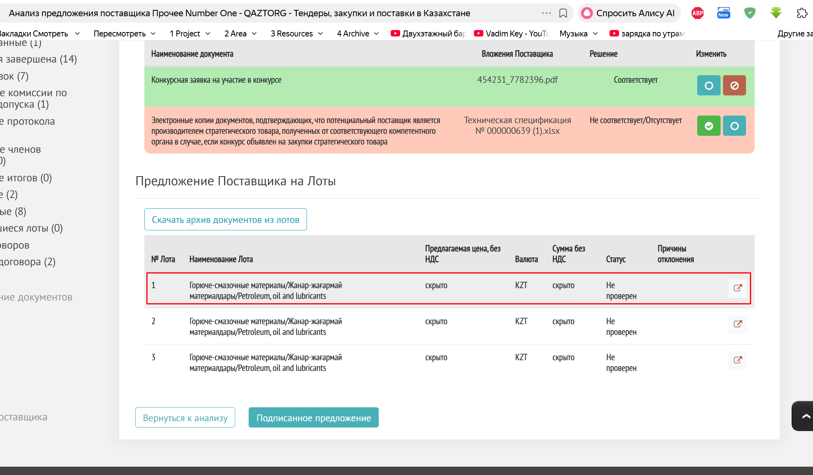{width=2050px height=1200px}

**Важно: до проведения допуска все цены в предложениях поставщиков скрыты.**

### Отклонение всего предложения поставщика

В случае, если документация поставщика не верна необходимо отклонить предложение поставщика.

Для этого напишите комментарий в поле «Причина отклонения»

Затем нажмите кнопку «Отклонить»

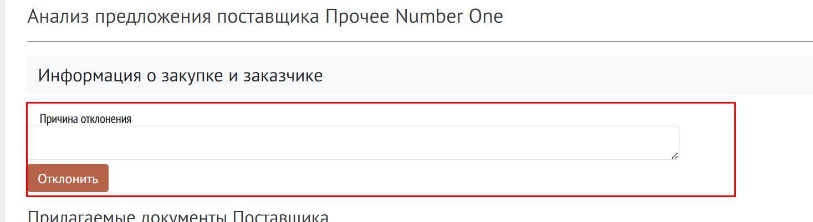{width=1467px height=401px}

Можно отменить решение

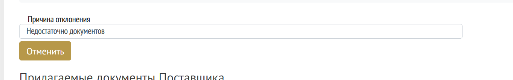{width=1362px height=213px}

**Важно:** в случае отклонения отклоняется всё предложение поставщика со всеми лотами.

Проверку лотов в данном случае можно не проводить.

---

## Анализ предложения по лоту

Иконка «стрелка открывает анализ по лоту в отдельном окне

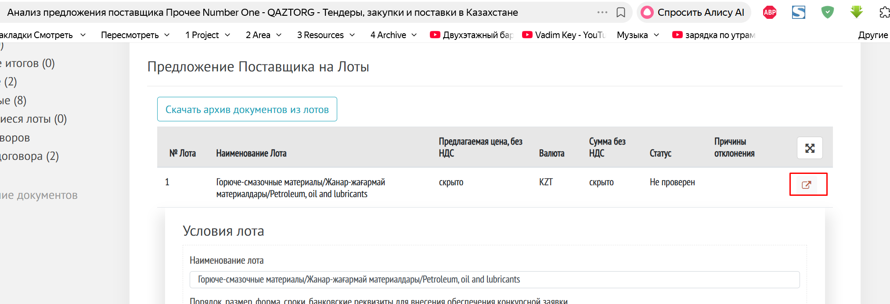{width=2027px height=694px}

Также можно открыть сравнение не переходя на отдельную страницу, нажав на строку лота.

Откроется информация по лоту.

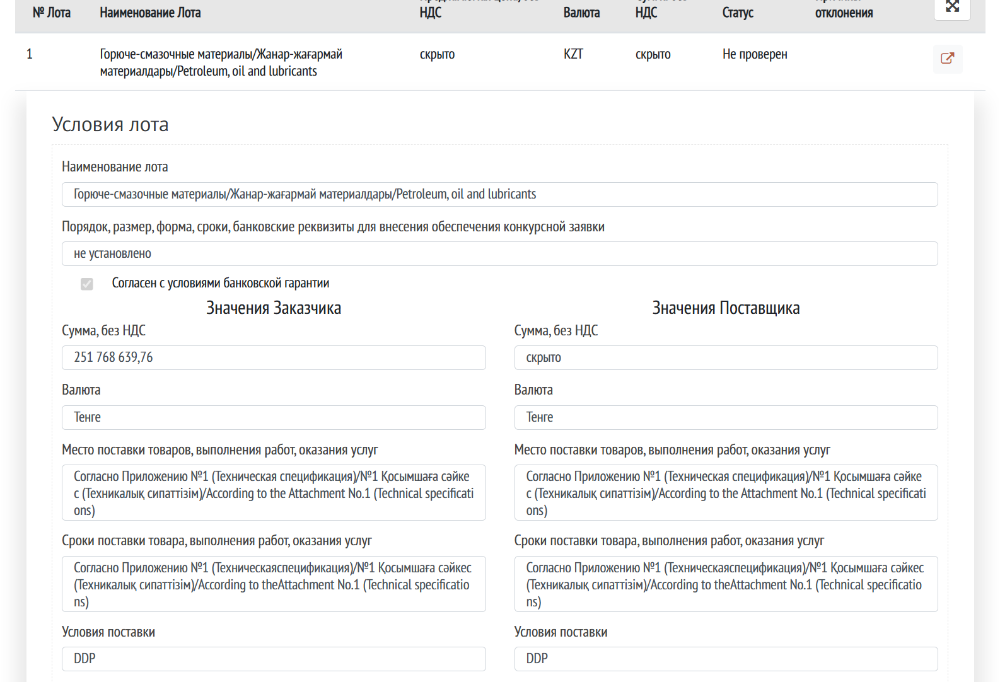{width=1586px height=1082px}

В левой части отображаются значения заказчика, в правой - поставщика.

На странице выполняется сравнение:

### Условия:

-  Цена

-  Сроки

-  Условия оплаты

-  Характеристики

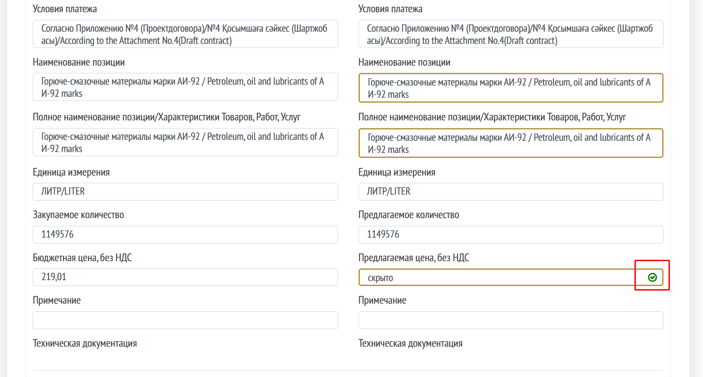{width=1549px height=833px}

### Действия:

-  **Принять лот**

-  **Отклонить лот**

:::quote 

При отклонении обязательно заполнить поле **«Причина отклонения»**

:::

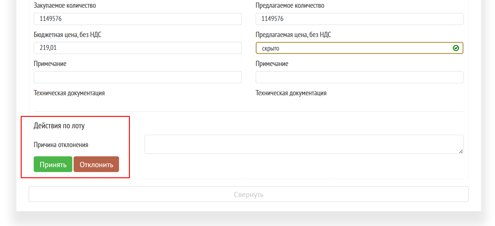{width=1601px height=733px}

---

### Цветовая индикация:

-  🟢 Зеленый -- принят

-  🔴 Красный -- отклонен

-  ⚪ Белый -- не обработан

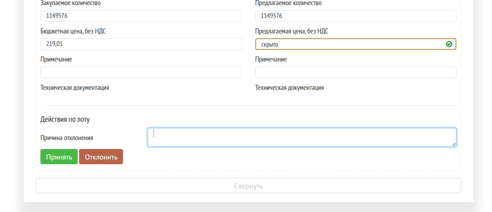{width=1644px height=710px}

После нажатия Принять лот окрашивается в зеленый

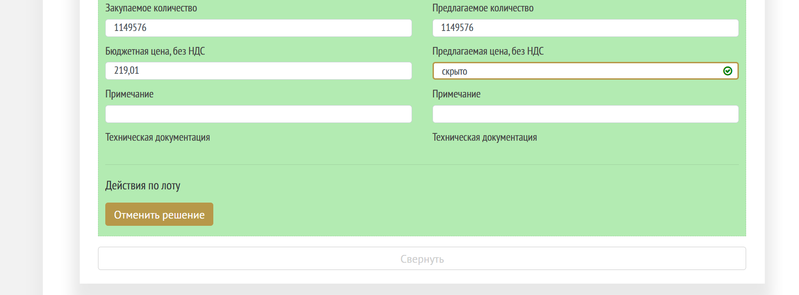{width=1753px height=648px}

Кнопка «Отменить решение» Можно отменить решения и принять другое.

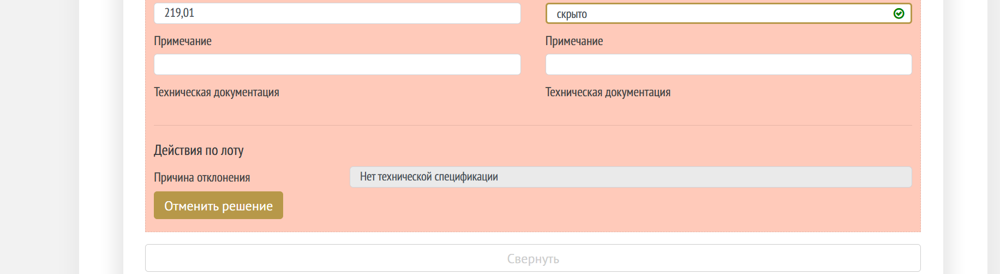{width=1833px height=504px}

При отклонении одного лота остальные не отклоняются и могут быть приняты.

## Возврат к анализу поставщиков

После проверки одно поставщика вернитесь на страницу общего анализа

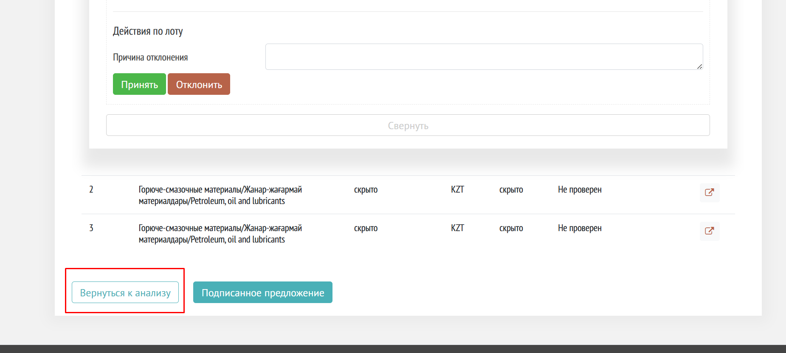{width=1851px height=834px}

---

## Двухэтапный анализ (для тендеров)

### Этап 1 До проведения допуска

-  Цены скрыты

-  Предложение поставщика недоступно для скачивания.

При нажатии на кнопку «Подписанное предложение» открывается страница в доступе отказано.

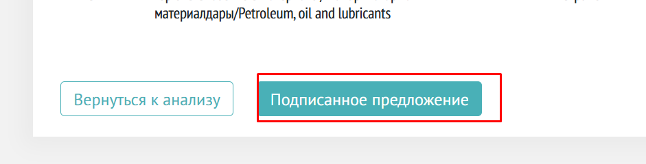{width=941px height=240px}

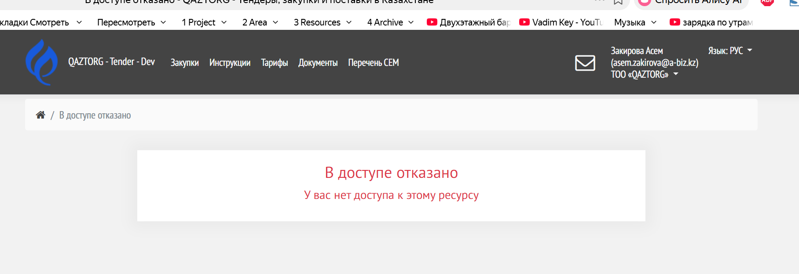{width=1816px height=624px}

### Этап 2 После проведения допуска

-  Цены становятся доступны

-  Предложение поставщика доступно к просмотру

---

## Завершение анализа заявок

После обработки всех поставщиков таблица окрашивается в цвета

Красный - предложение отклонено полностью

Зеленый - предложение допущено. Но внутри могут быть отклоненные лоты.

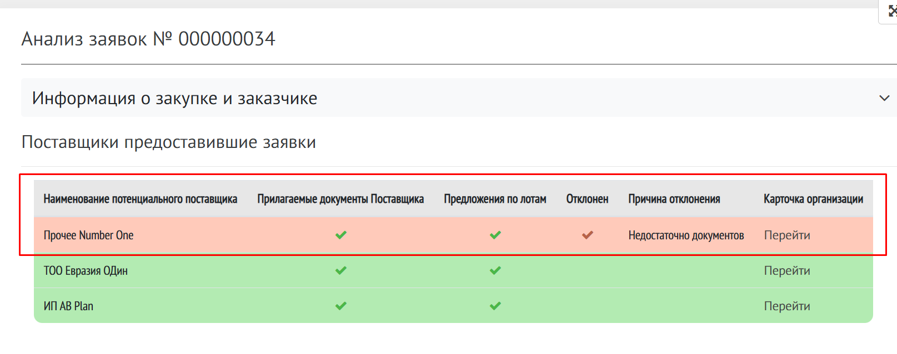{width=1615px height=639px}

## Установка комиссии

### Информация о комиссии

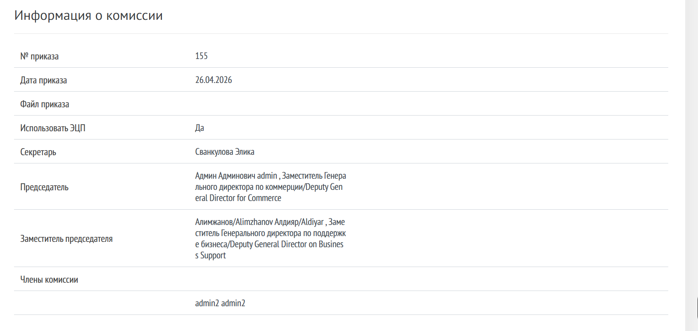{width=1690px height=802px}

Отображается таблица с чл.комиссии, которые были указаны при создании объявления, на этапе [Черновик](./../chernovik-obyavleniya/_index).

### Настройки комиссии

Следующий раздел Настройки комиссии.

**Важно: вложение файла приказа обязательно!**

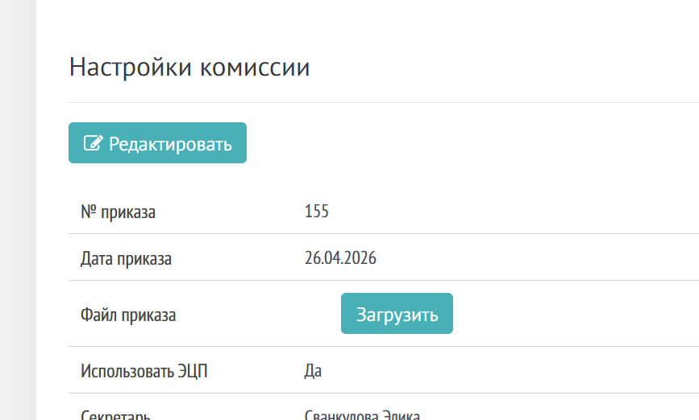{width=867px height=522px}

Нажмите на кнопку «Загрузить»

Выберите на компьютере файл приказа о составе комиссии.

Вложенный файл приказа будет отображен в поле

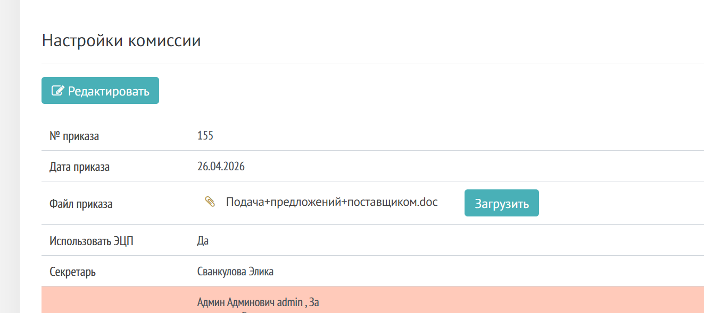{width=1323px height=590px}

Если необходимо загрузить другой документ, снова нажмите Загрузить.

Новый загруженный файл заменит предыдущий.

### Создание новой комиссии

Кнопка Создать новую комиссию открывает поля для редактирования комиссии.

При нажатии отображается уведомление

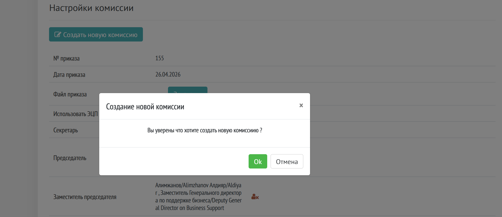{width=1781px height=774px}

-  Можно заменить всех чл. комиссии или только нескольких.

-  Изменить остальные поля

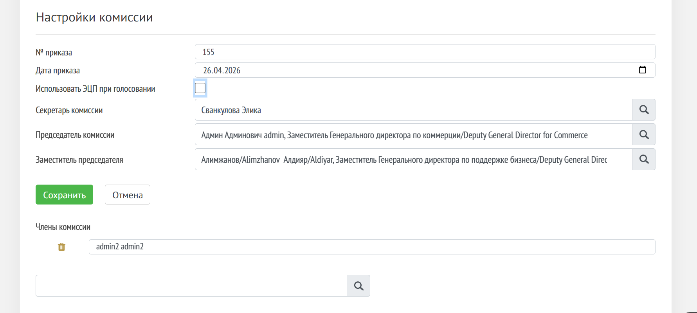{width=1781px height=802px}

**Важно: при сохранении будьте внимательны, установлена ли кнопка Использовать ЭЦП при голосовании.**

После внесения изменений нажмите «Сохранить».

Для отмены изменений нажмите «Отмена».

После сохранения отображается новая комиссия.

### Указание отсутствующих

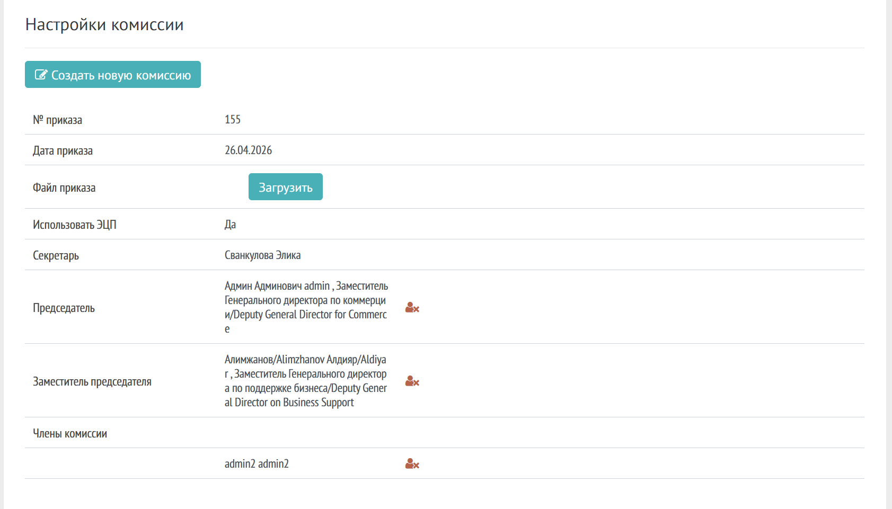{width=1683px height=961px}

### Отсутствующие чл.комиссии

Для указания отсутствующих нажмите на иконку «красный человек».

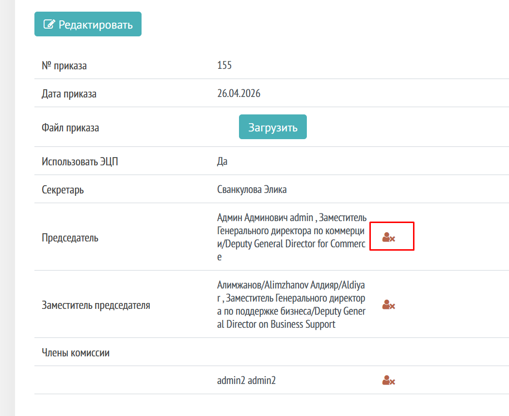{width=1050px height=858px}

Откроются поля для внесения причины отсутствия и файла приказа об отсутствии.

Нажмите Сохранить

Отсутствующий выделяется красным

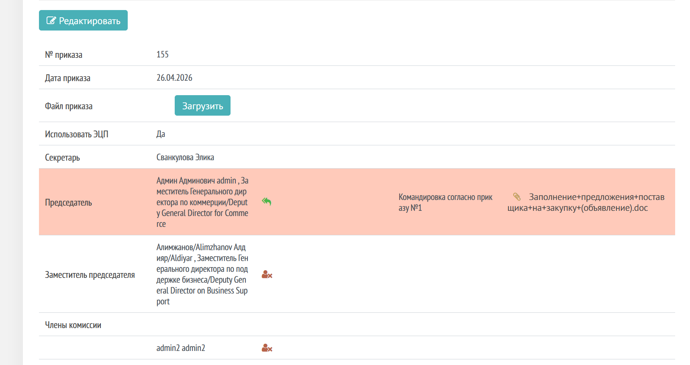{width=1718px height=909px}

Чтобы отменить отсутствие нажмите на зеленую стрелку

---

## Опции

Привлечь Технического эксперта запускает процесс проверки объявления технического эксперта.

Провести переторжку запускает процесс переторжки после завершения объявления.

## Запуск протокола допуска

Если допуск еще не был проведен, то будет отображаться кнопку «Запустить протокол допуска»

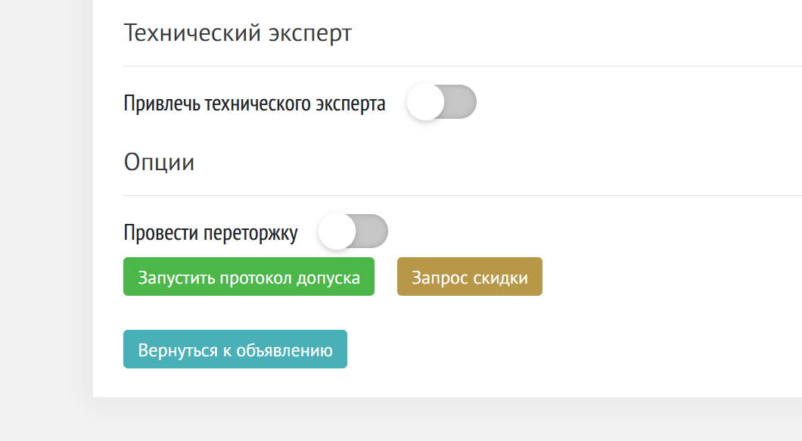{width=1060px height=583px}

При нажатии на кнопку всплывает уведомление

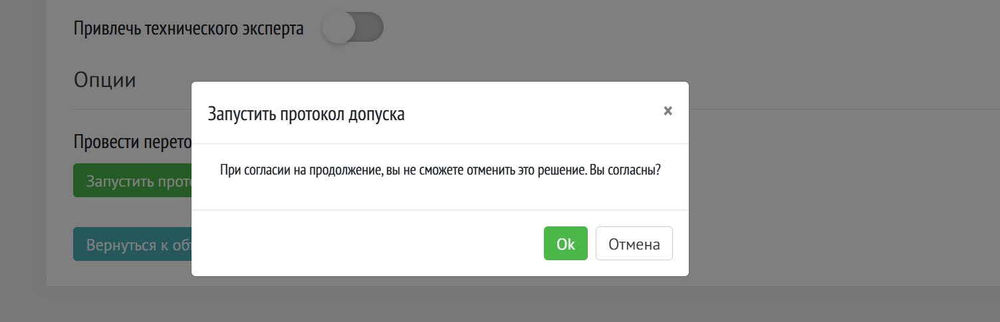{width=1504px height=485px}

При нажатии на Ок открывается страница Протокола допуска.

Объявление переходит на статус «Голосование комиссии по протоколу допуска»

---

## Дополнительная заявка (после преддопуска)

В зависимости от действий поставщика отображается:

-  **Подписана** -- заявка отправлена

-  **Не подписана** -- файл загружен, но не отправлен

-  **Не заполнена** -- действий не было

-  **Не отображается** -- запрос не отправлялся

---