Страница «Черновик» предназначена для подготовки объявления о закупке перед публикацией.

На этом этапе заказчик заполняет все необходимые данные, добавляет лоты и документы.

---

## 1\. Общая информация

### Информация о закупке

Содержит основные параметры:

-  Наименование организации

-  Статус объявления -- **Черновик**

-  Вид закупки

-  Способ закупки (например, тендер)

-  Тип торгов

-  Количество предложений

### Информация о заказчике

Отображаются данные:

-  Оператор ЭТП

-  Телефон

-  Email

-  Наименование компании

-  Почтовый адрес

-  Электронный адрес

Данные заполняются автоматически

{width=1881px height=565px}

### Функциональные кнопки

**"Хлебные крошки» вверху страницы**

«Адрес» страницы и разделов в котором мы находимся, активно для перехода на предыдущие страницы

**Черные стрелки в правом верхнем углу**

Уменьшает и увеличивает окно объявления, скрывая и показывая левое меню

**Желтая звезда в правом верхнем углу**

Добавляет объявление в [Избранные объявления](./../../izbrannye-obyavleniya)

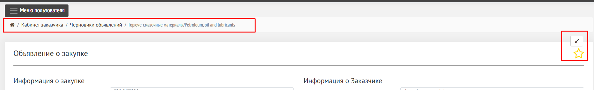{width=1864px height=285px}

---

## 3\. Лоты закупки

Раздел для добавления предмета закупки.

**Возможности:**

-  добавить лоты из [Перечня (ГПЗ, ДПЗ)](./../../organizaciya/perechen/_index)

-  импортировать из файла

   -  для этого необходимо скачать шаблон для заполнения

{width=1850px height=547px}

Для каждого лота указываются:

-  наименование

-  характеристики

-  единицы измерения

-  количество

-  цена

-  условия поставки

-  сроки

-  условия оплаты

-  другие поля

Пример шаблона для ручной загрузки [Лоты.xlsx](Лоты.xlsx)

{width=1788px height=304px}

### Лоты после заполнения:

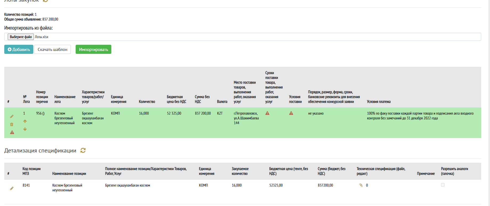{width=1840px height=773px}

После загрузки необходимо заполнить обязательные поля, которые не загружены из файла для импорта.

Нажмите иконку «карандаш» для редактирования полей по лотам.

Поля для заполнения:

-  Сроки поставки товара, выполнения работ, оказания услуг

-  Условия поставки (выбор из списка)

   -  DDP, CFR, CIF, CIP, CPT, DAP, DAT, EXW, FAS, FCA, FOB, Работа, Услуга

-  Порядок, размер, форма, сроки, банковские реквизиты для внесения обеспечения конкурсной заявки

-  Условия платежа

-  Применить ко всем лотам галочка. Если да, то во все лоты, если их несколько, будут заполнены поля.

Нажмите кнопку Сохранить

Кнопка Отмена отменяет изменения в тексте полей лота и закрывает окно редактирования лота.

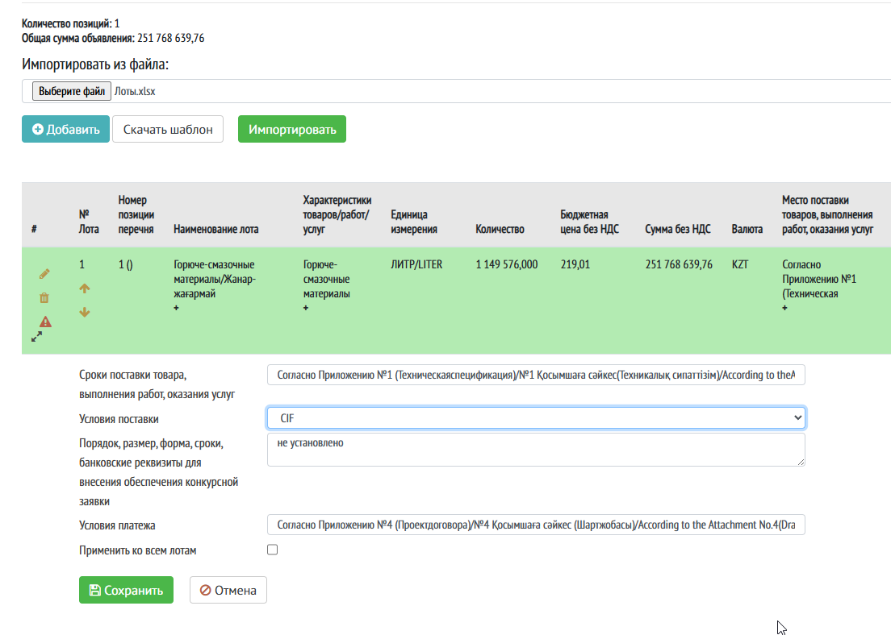{width=1104px height=788px}

**Полезное:**

-  Лоты можно сделать неделимыми с помощью деталей в спецификации

-  ознакомьтесь со статьей [Лоты и детали](./../../loty-i-detali)

### Функциональные кнопки

**Иконка «карандаш»**

Открывает поля для редактирования по лотам

**Иконка «корзина»**

Удаляет лот

**Черные стрелки**

Расширяют лот для чтения больших текстов в полях лота

**Оранжевые стрелки вверх и вниз**

Меняют лоты местами

**Черный плюсик под текстом в столбцах**

Показывает дополнительное окно для чтения всего текста

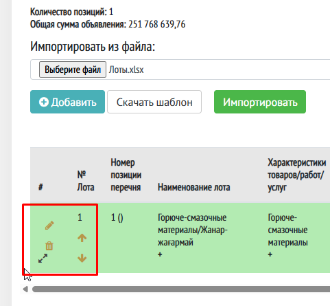{width=481px height=445px}

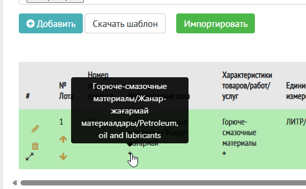{width=521px height=323px}

### Детализация спецификации

В детализации находится более полная информация о лоте, техническая документация.

**Разрешить аналоги**

Галочка, По умолчанию выключено.

При включении дает возможность поставщику изменить название детали и предложить свой вариант.

**Примечание**

Поле для указания дополнительной информации по данной детали.

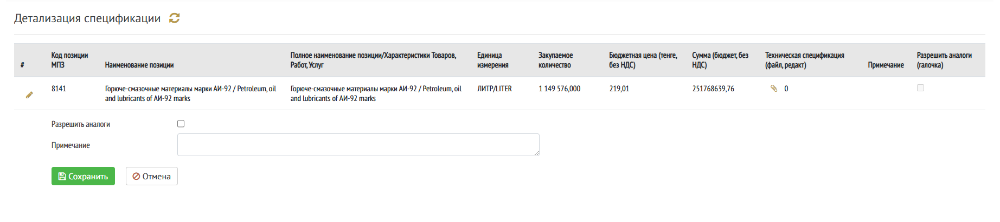{width=1844px height=411px}

**Техническая спецификация - иконка «скрепка»**

Чтобы вложить техническую спецификацию по конкретной детали лота нажмите на иконку скрепки.

Откроется раздел Добавить документ.

Выберите файл на компьютере

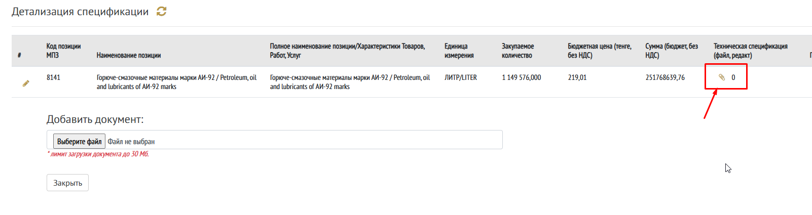{width=1602px height=425px}

Файл отобразится в разделе

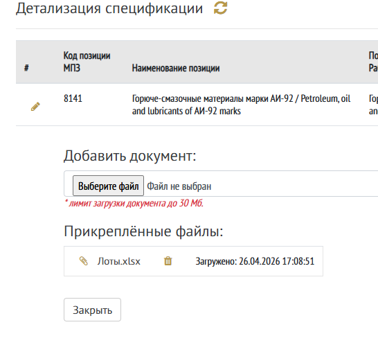{width=546px height=524px}

По необходимости вложите несколько файлов.

Нажмите Закрыть.

После этого файл будет прикреплен к детали.

Для изменения прикрепленных файлов снова нажмите на иконку «скрепка»

Иконка «корзина» удаляет файл.

**Важно:**

-  файл должен весить не более 30 Мб

---

## 4\. Прилагаемые документы заказчика

Раздел для загрузки документов:

-  можно прикрепить типовой договор - необязательно

-  можно загрузить другие файлы документации по закупке - обязательно

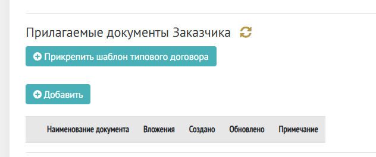{width=632px height=265px}

Ознакомьтесь со статьей [Типовые договоры](./../../tipovye-dogovory)

Необходимо добавить хотя бы один документ в раздел «Прилагаемые документы Заказчика»

Нажмите кнопку «Добавить»

Откроется раздел для выбора типа документа

Нажмите на иконку «лупа»

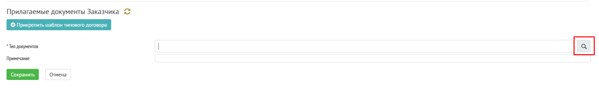{width=1837px height=280px}

В модальном окне выберите тип документа, который будете вкладывать

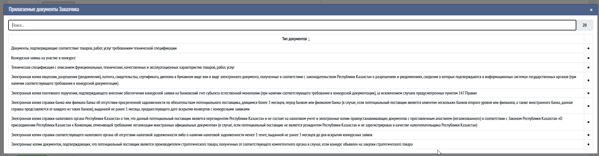{width=1903px height=497px}

Поле «Примечание» не обязательное для заполнение, но будет видно всем пользователям после публикации.

Нажмите «Сохранить».

Выбранный тип документа отобразится в окне.

Чтобы вложить файл к типу документа нажмите на иконку «скрепка»

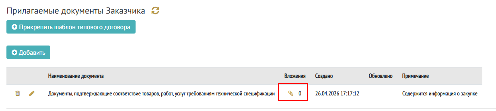{width=1233px height=278px}

Нажмите Добавить файл, чтобы выбрать файл на компьютере

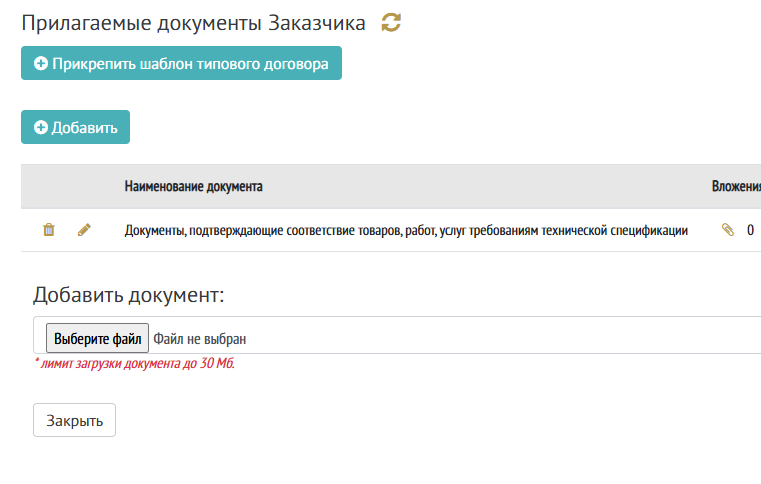{width=761px height=484px}

Вложите несколько файлов, если необходимо.

Нажмите «Закрыть».

Возле иконки «скрепка» отобразится количество вложенных файлов.

Повторите выбор типа файла документа через кнопку Добавить, если необходимо вложить несколько типов.

**Пример заполненного раздела**

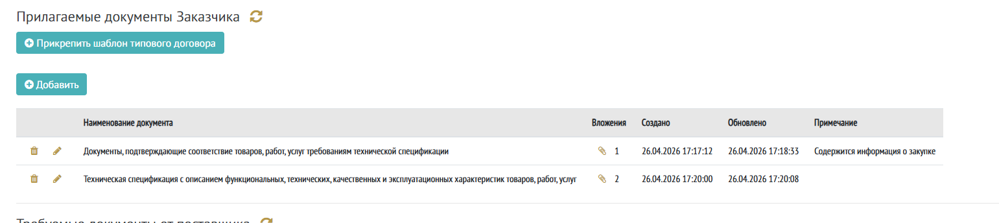{width=1541px height=344px}

Для редактирования вложенных документов нажмите на иконку «скрепка».

Иконка «корзина» удаляет типы файлов вместе с документами

Иконка «карандаш» открывает окно редактирования типа документа

**Важно:**

-  размер файла не должен превышать 30 Мб

-  ограничение по форматам вложений: pdf, xlsx, xls, doc, docx, jpg, png, zip

---

## 5\. Требуемые документы от поставщика

Определяет, какие документы должен предоставить участник.

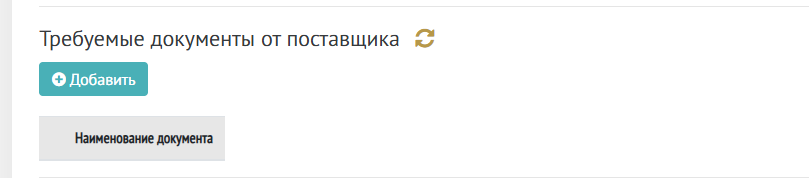{width=809px height=178px}

Для требуемых документов поставщика нажмите на кнопку «Добавить».

Выберите нужный тип документа, который должен предоставить Поставщик, аналогично выбору типа документа в разделе прилагаемые документы заказчика.

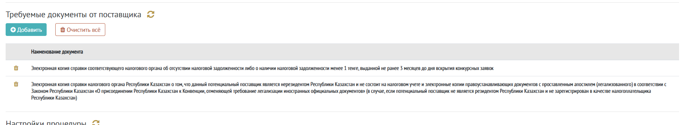{width=1827px height=334px}

Кнопка «Очистить все» удаляет все типы документов

Иконка «корзина» удаляет типы документов по одному

---

## 6\. Настройки процедуры

Раздел с параметрами проведения закупки.

Настройки влияют на правила участия поставщиков.

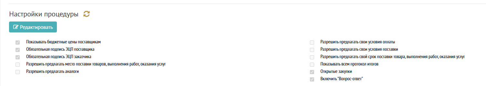{width=1504px height=268px}

**По умолчанию для Тендера включены такие настройки:**

* [x] Показывать бюджетные цены поставщикам

* [x] Обязательная подпись ЭЦП поставщика

* [x] Обязательная подпись ЭЦП заказчика

* [ ] Разрешить предлагать место поставки товаров, выполнения работ, оказания услуг

* [ ] Разрешить предлагать аналоги

* [ ] Разрешить предлагать свои условия оплаты

* [ ] Разрешить предлагать свои условия поставки

* [ ] Разрешить предлагать свой срок поставки товара, выполнения работ, оказания услуг

* [ ] Показывать всем протокол итогов

* [x] Открытые закупки

* [x] Включить "Вопрос-ответ"

Подробнее о настройках процедур: [статья](./../../nastroyki-procedur)

---

## 7\. Выбор поставщиков

Используется для:

-  ограничения участия

-  приглашения конкретных поставщиков

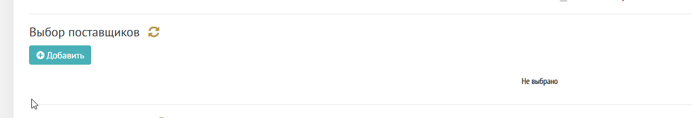{width=1214px height=208px}

Для выбора поставщиков для приглашения в участии нажмите «Добавить»

Откроется окно для поиска поставщика в системе. 

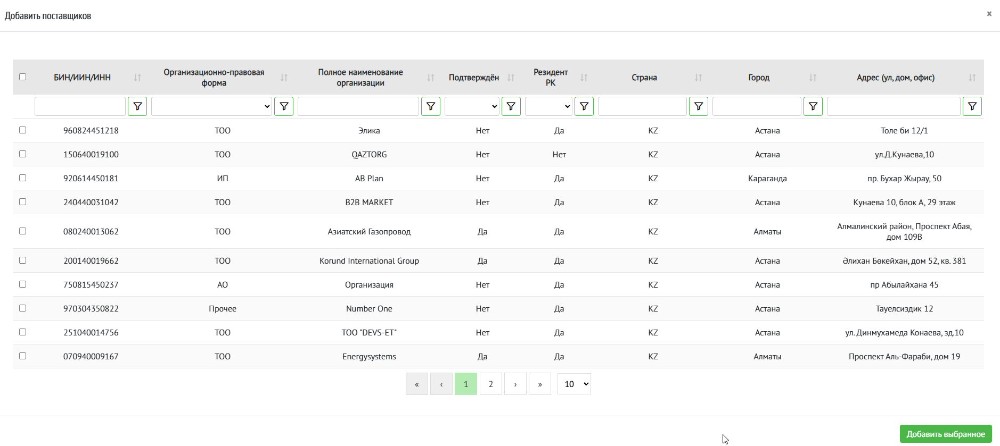{width=1878px height=839px}

Воспользуйтесь фильтрами и поиском вверху таблицы для поиска по названию или по БИН. 

Поставьте галочку в первом строке нужной строки. 

Выберите галочками нескольких поставщиков по необходимости.

Нажмите «Добавить выбранное» в правом нижнем углу

Выбранный участник отобразится в разделе 

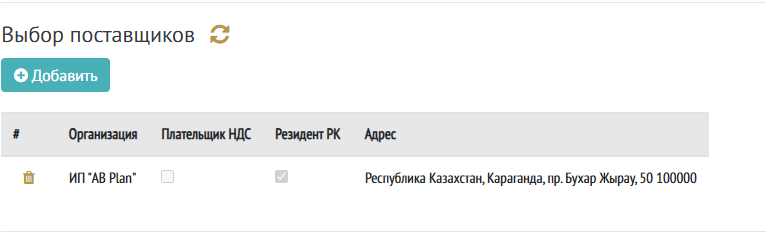{width=766px height=233px}

**Важно:** 

-  Даже если участник/участники выбраны, процедура все равно остается открытой для всех поставщиков ЭТП

-  Если необходимо ограничить процедуру только выбранными участниками, выключите настройку Открытые закупки в разделе «Настройки процедуры». 

---

## 8\. Конкурсная комиссия

Для Тендера по умолчанию 

Настройка комиссии:

-  включение/отключение комиссии

-  добавление членов комиссии

-  назначение ролей (председатель, секретарь и т.д.)

Также можно:

-  указать приказ

-  прикрепить файл

---

## 9\. Настройки публикации

Задаются параметры объявления:

-  наименование на русском языке

-  наименование на казахском языке

-  срок действия предложения

-  допустимый демпинг

---

## 10\. Настройки сроков

Определяются сроки проведения:

-  дата начала приема заявок

-  продолжительность

-  дата окончания

---

## 11\. Документация

Раздел для:

-  скачивания объявления

-  проверки сформированных данных

---

## Доступные действия

Внизу страницы доступны кнопки:

-  **Удалить** -- удаление черновика

-  **Готово к публикации** -- перевод объявления в следующий статус

---

## Особенности статуса «Черновик»

-  объявление не видно поставщикам

-  можно редактировать все поля

-  можно добавлять и удалять данные

-  публикация возможна только после заполнения обязательных полей

---

## Рекомендации

-  заполните все обязательные поля

-  проверьте лоты и суммы

-  прикрепите необходимые документы

-  корректно укажите сроки

---

## Результат

После нажатия **«Готово к публикации»**:

-  объявление переходит к следующему этапу

-  становится доступным для публикации

## Возможные ошибки

### Не найдена еденица измерения

:::danger 

Ошибка при импорте: Ошибка при обработке записи №1, строка: 2 ,

Ошибка: Не найдена еденица измерения - 'ЛИТР/LITER'.

Для добавления обратитесь к администратору

:::

Означает, что в справочнике нет такой ед.измерения. Необходимо обратиться в [техническую поддержку](./../../kontaktnye-dannye-tekhnicheskoy-podderzhki) с просьбой добавить нужную ед.измерения

[image:./chernovik-obyavleniya-5.png:::0,0,100,100:::466px:384px:left]