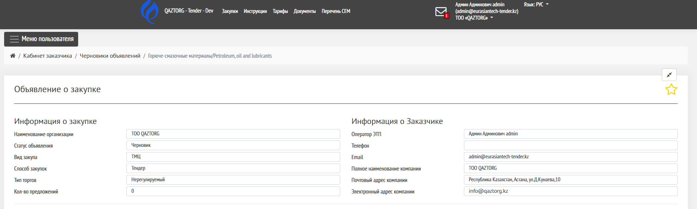
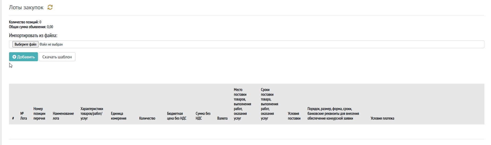
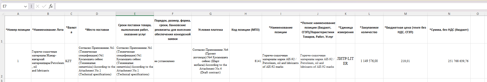

Страница «Черновик» предназначена для подготовки объявления о закупке перед публикацией.

На этом этапе заказчик заполняет все необходимые данные, добавляет лоты и документы.

---

## 1\. Общая информация 

### Информация о закупке 

Содержит основные параметры:

-  Наименование организации

-  Статус объявления -- **Черновик**

-  Вид закупки

-  Способ закупки (например, тендер)

-  Тип торгов

-  Количество предложений

### Информация о заказчике

Отображаются данные:

-  Оператор ЭТП

-  Телефон

-  Email

-  Наименование компании

-  Почтовый адрес

-  Электронный адрес

Данные заполняются автоматически

{width=1881px height=565px}

---

## 3\. Лоты закупки

Раздел для добавления предмета закупки.

Возможности:

-  добавить лоты из [Перечня (ГПЗ, ДПЗ)](./../../organizaciya/perechen)

-  импортировать из файла

   -  для этого необходимо скачать шаблон для заполнения

{width=1850px height=547px}

Для каждого лота указываются:

-  наименование

-  характеристики

-  единицы измерения

-  количество

-  цена

-  условия поставки

-  сроки

-  условия оплаты

-  другие поля

Пример шаблона для ручной загрузки [Лоты.xlsx](Лоты.xlsx)

{width=1788px height=304px}

### Лоты после заполнения:

---

## 4\. Прилагаемые документы заказчика

Раздел для загрузки документов:

-  можно прикрепить типовой договор

-  можно загрузить дополнительные файлы

Отображаются:

-  название документа

-  дата создания

-  дата обновления

---

## 5\. Требуемые документы от поставщика

Определяет, какие документы должен предоставить участник.

Возможности:

-  добавить требования

-  удалить требования

Пример:

-  заявка на участие

---

## 6\. Настройки процедуры

Раздел с параметрами проведения закупки.

Доступные настройки:

-  обязательность подписания заявок

-  требования к ЭЦП

-  условия допуска

-  дополнительные параметры

Настройки влияют на правила участия поставщиков.

---

## 7\. Выбор поставщиков

Используется для:

-  ограничения участия

-  приглашения конкретных поставщиков

Если поставщики не выбраны -- закупка открытая.

---

## 8\. Конкурсная комиссия

Настройка комиссии:

-  включение/отключение комиссии

-  добавление членов комиссии

-  назначение ролей (председатель, секретарь и т.д.)

Также можно:

-  указать приказ

-  прикрепить файл

---

## 9\. Настройки публикации

Задаются параметры объявления:

-  наименование на русском языке

-  наименование на казахском языке

-  срок действия предложения

-  допустимый демпинг

---

## 10\. Настройки сроков

Определяются сроки проведения:

-  дата начала приема заявок

-  продолжительность

-  дата окончания

---

## 11\. Документация

Раздел для:

-  скачивания объявления

-  проверки сформированных данных

---

## Доступные действия

Внизу страницы доступны кнопки:

-  **Удалить** -- удаление черновика

-  **Готово к публикации** -- перевод объявления в следующий статус

---

## Особенности статуса «Черновик»

-  объявление не видно поставщикам

-  можно редактировать все поля

-  можно добавлять и удалять данные

-  публикация возможна только после заполнения обязательных полей

---

## Рекомендации

-  заполните все обязательные поля

-  проверьте лоты и суммы

-  прикрепите необходимые документы

-  корректно укажите сроки

---

## Результат

После нажатия **«Готово к публикации»**:

-  объявление переходит к следующему этапу

-  становится доступным для публикации