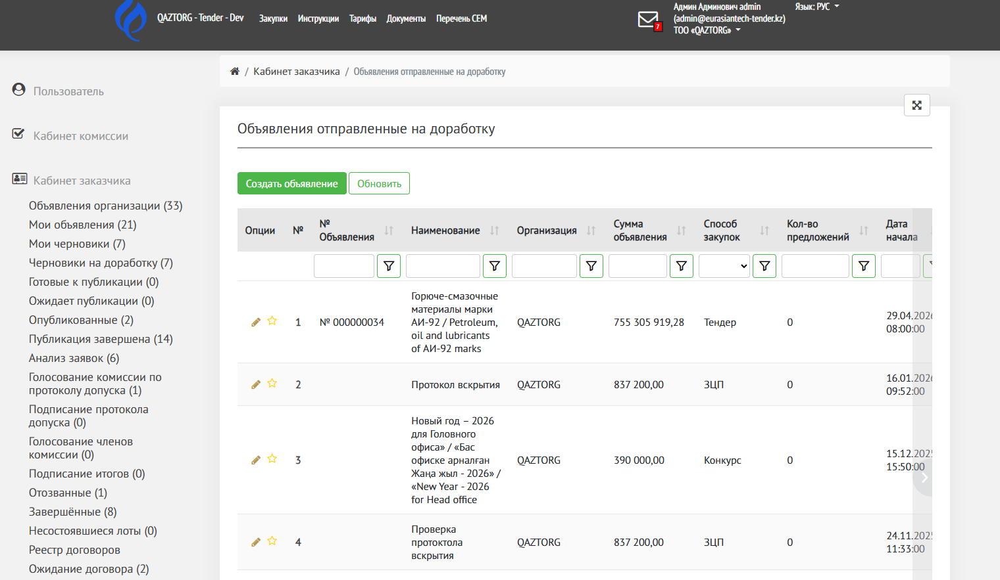
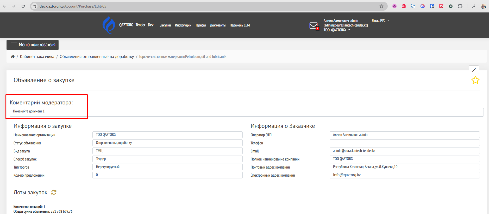
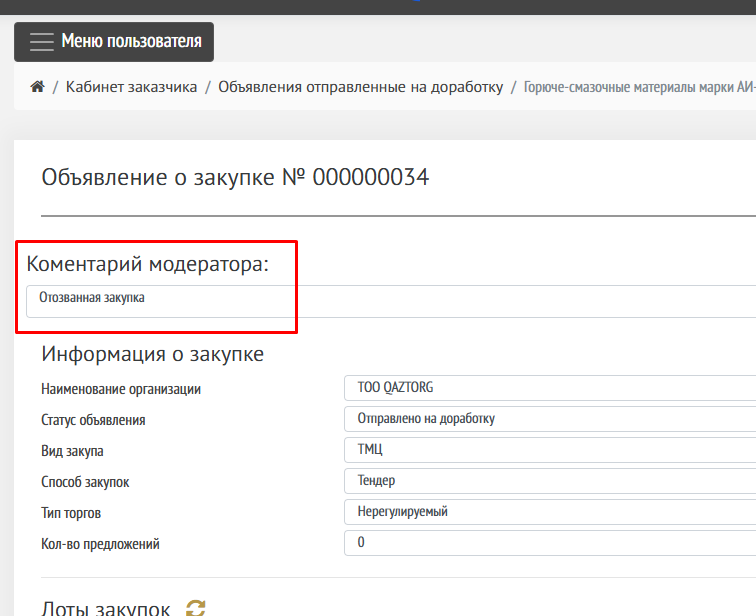
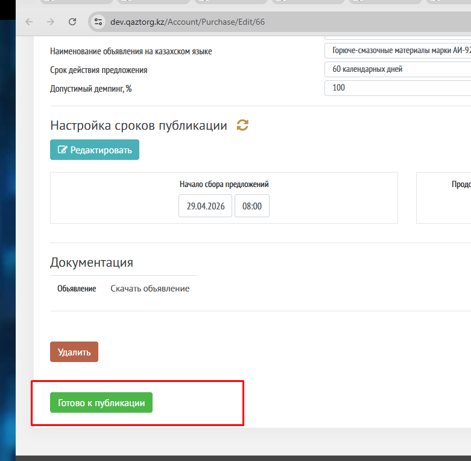

Страница предназначена для просмотра объявлений, которые были отправлены на доработку. 

Перейдите в Кабинет заказчика, найдите раздел «Черновики на доработку».

Нажмите на иконку «карандаш», чтобы открыть страницу объявления.

{width=1520px height=883px}

## Отправка на доработку со статуса Готово к подписанию

Если согласующий после проверки отправляет на доработку, то при переходе в объявление будет виден комментарий, который написан согласующим. 

{width=1878px height=824px}

## Отправка на доработку если не подписано объявление, автоматическое 

## Отозванная закупка до публикации 

Если объявление было отозвано до публикации, на стадии «[Ожидание публикации](./ozhidanie-publikacii)», то вверху объявления будет отображаться комментарий «Отозванная закупка»

{width=756px height=616px}

## Подготовка к публикации

Для продолжения публикации необходимо снова отправить объявление на этап Готово к публикации, нажав на кнопку внизу страницы «Готово к публикации». 

{width=781px height=764px}

Также данное объявление можно удалить, нажав на кнопку «Удалить». 