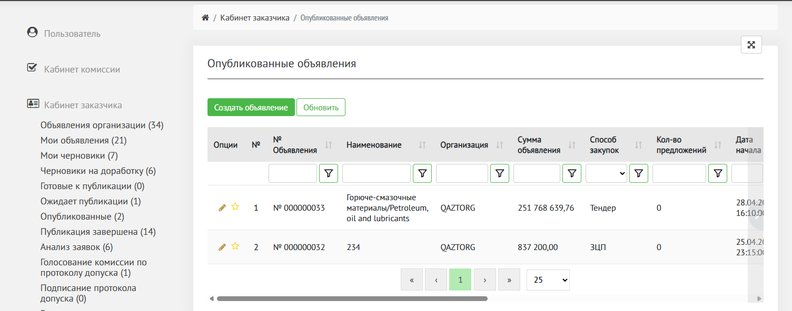

Для перехода в объявление в статусе опубликовано перейдите в раздел Кабинет заказчика, подраздел «[Опубликованные](https://dev.qaztorg.kz/Account/Purchase?status=Approved_Published)»

На странице отображена таблица с объявлениями в данном статусе.

Нажмите на иконку «карандаш», чтобы открыть объявление.

{width=1504px height=592px}

В данном статусе объявление закрыто для редактирования.

## Отмена закупки

На данном статусе возможно отменить закупку. Прочитать в статье «[Отменить закупку](./../../otmenit-obyavlenie)»

## Публикация завершена

После окончания срока публикации объявление оно переходит в статус «[Публикация завершена](./../publikaciya-zavershena)». 