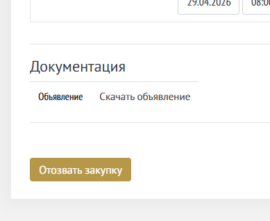
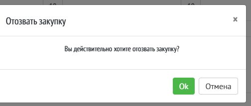
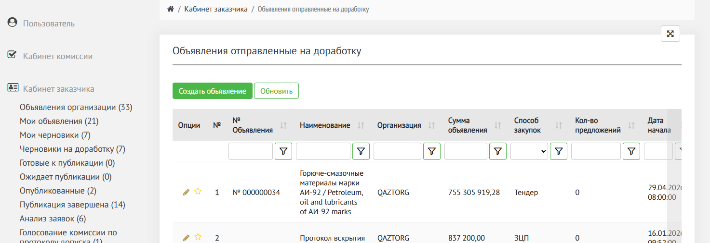

Для перехода к объявлению на данном статусе перейдите в статус «Ожидает публикации»

Нажмите на иконку «карандаш» в строке нужно объявления или на индексную цифру, например «1»

{width=1517px height=752px}

Откроется страница объявления для чтения.

В данном статусе объявление нельзя редактировать. Его можно отозвать.

Прокрутите объявление вниз до функциональных кнопок.

Отображается кнопка «Отозвать закупку»

{width=389px height=318px}

После нажатия на кнопку открывается модальное уведомление «Вы действительно хотите отозвать закупку?»

{width=504px height=213px}

При нажатии «Отмена» действие отменяется.

При нажатии «Ок» закупка возвращается на этап «[Черновики на доработку](./chernoviki-na-dorabotku)» и становится доступным для редактирования.

{width=1473px height=506px}

## Публикация закупки

В момент, когда наступает Дата «Начало сбора предложений» объявление автоматически переходит в статус «[Опубликовано](./opublikovano)».

Объявление отображается на главной странице закупок <https://qaztorg.kz/> и доступно для подачи предложений поставщикам.