Данная страница предназначена для проверки и финального согласования объявления перед публикацией.\
На этом этапе редактирование ограничено, и пользователь выполняет контроль данных и запуск публикации.

---

## Общая информация

В верхней части страницы отображаются:

### Информация о закупке:

-  Наименование организации

-  Статус объявления: **Готово к публикации**

-  Вид закупки

-  Способ закупки

-  Тип торгов

-  Количество предложений

### Информация о заказчике:

-  Оператор ЭТП

-  Контактные данные

-  Наименование компании

-  Адрес

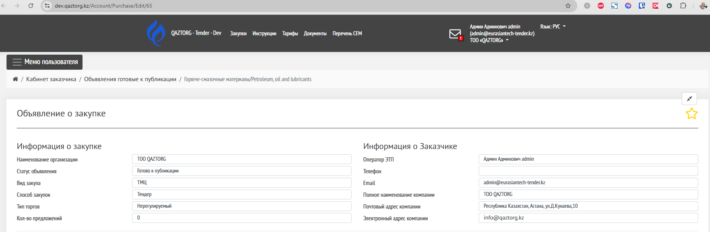{width=1866px height=612px}

---

## Лоты закупки

Отображается список добавленных лотов.

### В таблице доступны:

-  Номер лота

-  Наименование

-  Характеристики

-  Количество

-  Цена

-  Сумма

-  Условия поставки

❗ На данном этапе редактирование лотов недоступно.

Для просмотра вложенных деталей лота нажмите на строку с лотом.

Откроется подраздел «Детализация спецификации.

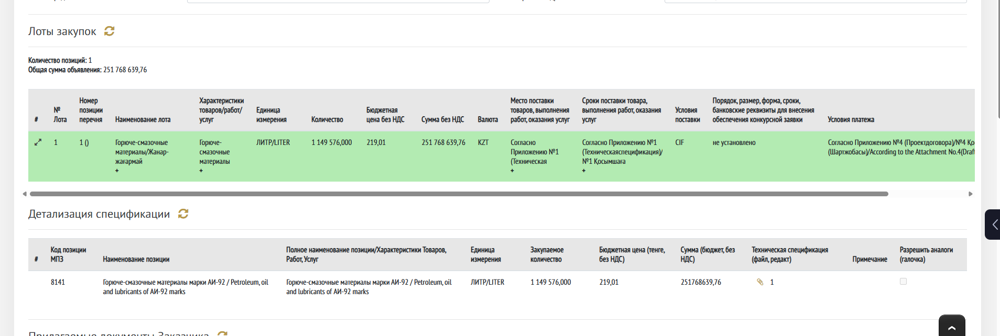{width=1908px height=642px}

---

## Прилагаемые документы заказчика

Отображаются документы, прикрепленные к объявлению.

### В таблице:

-  Наименование документа

-  Количество вложений

-  Дата создания и обновления

-  Примечание

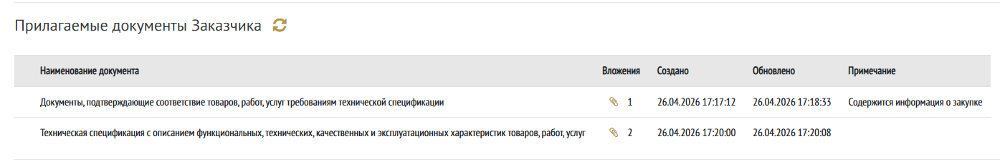{width=1395px height=230px}

---

## Требуемые документы от поставщика

Список документов, которые обязан предоставить поставщик при подаче предложения.

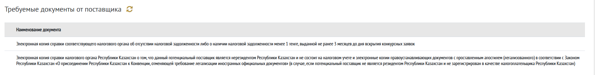{width=1836px height=233px}

---

## Настройки процедуры

Отображаются выбранные параметры проведения закупки:

-  Требования к ЭЦП

-  Ограничения подачи предложений

-  Условия участия

-  Включение дополнительных модулей (например, "Вопрос-ответ")

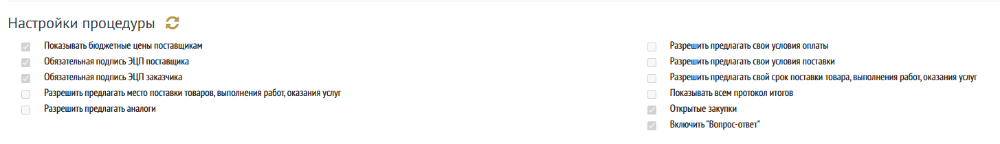{width=1455px height=210px}

---

## Выбор поставщиков

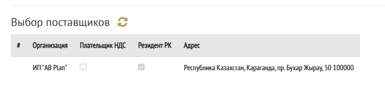{width=753px height=171px}

## Конкурсная комиссия

Отображается состав комиссии:

-  № приказа

-  Дата приказа

-  Использование ЭЦП

-  Секретарь

-  Председатель

-  Члены комиссии

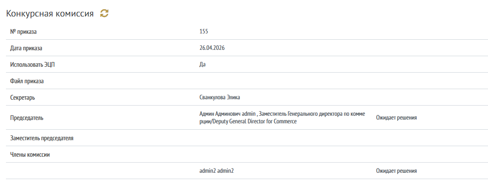{width=1152px height=438px}

---

## Настройки публикации

Отображаются параметры объявления:

-  Наименование объявления

-  Наименование на разных языках

-  Срок действия предложения

-  Допустимый демпинг

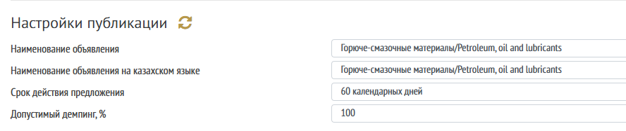{width=888px height=187px}

---

## Настройка сроков публикации

Отображаются установленные сроки:

-  Дата начала приема предложений

-  Продолжительность

-  Дата завершения приема предложений

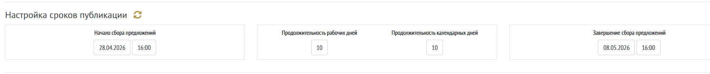{width=1709px height=181px}

---

## Документация

На данном этапе доступно скачивание предпросмотра объявления перед подписанием и запуском публикации

Для скачивания нажмите строку «Скачать объявления»

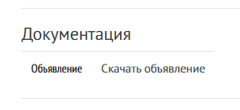{width=302px height=138px}

---

## Действия пользователя

В нижней части страницы доступны основные действия:

### Отправить на доработку

Позволяет вернуть объявление на предыдущий этап.

-  Необходимо указать комментарий

-  Объявление возвращается в статус Черновики на доработку

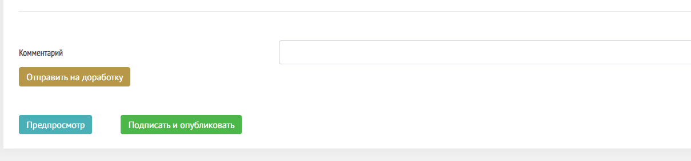{width=1209px height=283px}

---

### Предпросмотр

Также скачивается предпросмотр генерируемого документа Объявления перед подписанием

Для скачивания нажмите строку «Предпросмотр»

Пример документа «Объявление о закупке»  [Объявление (7).pdf](<Объявление (7).pdf>)

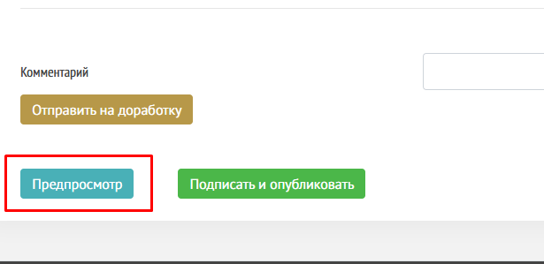{width=615px height=299px}

---

### Подписать и опубликовать

Финальное действие:

-  Если в настройках включена галочка «Обязательное подписание ЭЦП Заказчика

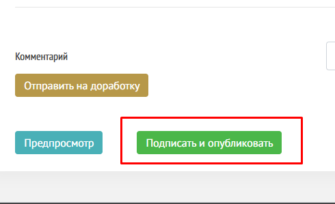{width=490px height=299px}

Открытие окна приложения NVALayer

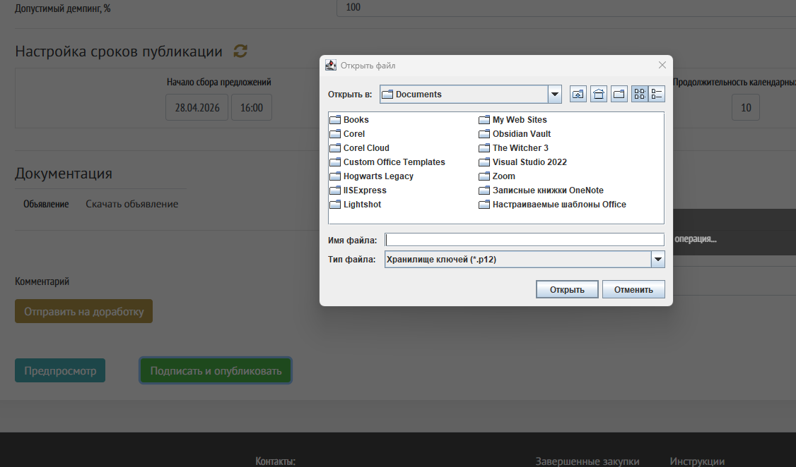{width=1126px height=662px}

---

## Результат

После успешного выполнения действия **Подписать и опубликовать**:

-  Объявление переходит в статус **Ожидание публикации**

-  Открывается страница статуса «Ожидает публикации»

   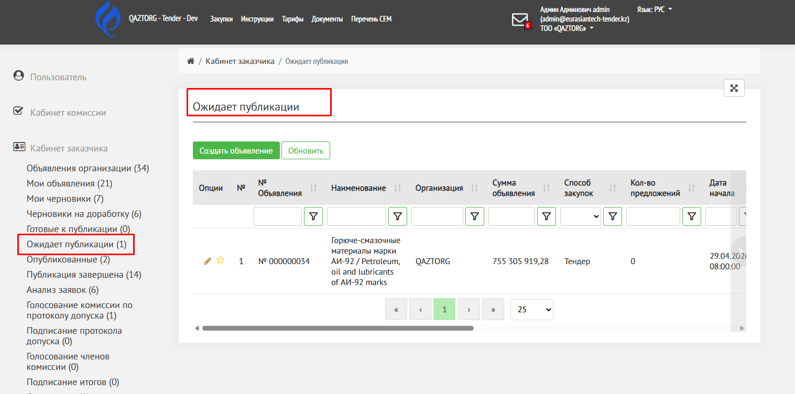{width=1517px height=752px}

## Возможные ошибки

[Запустите NCALAyer](./../../faq/zapustite-ncalayer)