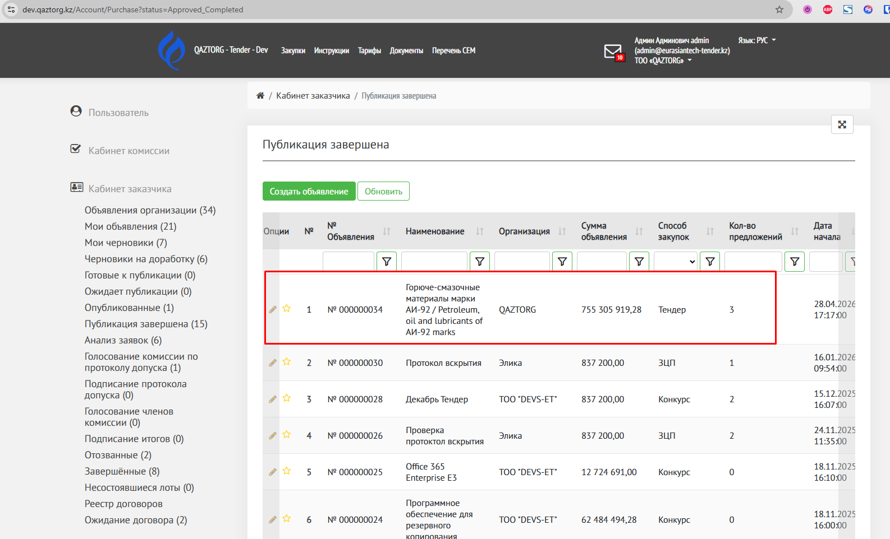
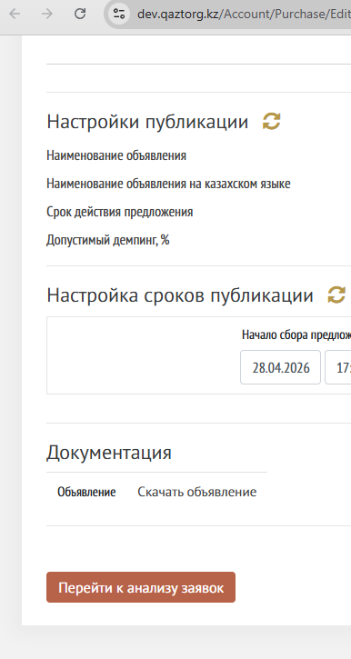
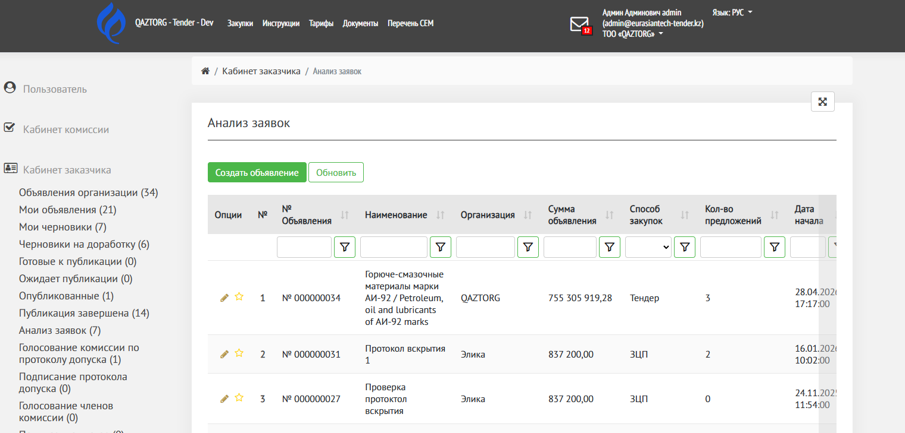

Данный статус необходим для отображения закупок для которых уже закончились сроки сбора предложений поставщиков.

Перейдите в Кабинет заказчика, раздел «Публикация завершена».

Если  в данном статусе есть объявления, значит они завершены со сроком публикации и их необходимо перевести в следующий статус «Анализ заявки» вручную.

На странице отображены закупки с истекшим временем публикации. 

Перейдите на страницу объявления, нажав на иконку «карандаш» 

{width=1586px height=962px}

Откроется страница объявления. 

Прокрутите страницу вниз, где отображена кнопка «Перейти к анализу заявок»

{width=386px height=725px}

Нажмите на кнопку. 

Объявление сменит статус на «Анализ заявок». 

Откроется страница с таблицей объявлений на статусе «Анализ заявок»

{width=1520px height=729px}

Ознакомьтесь со статьей про проведение [Анализа заявок](./analiz-zayavok)