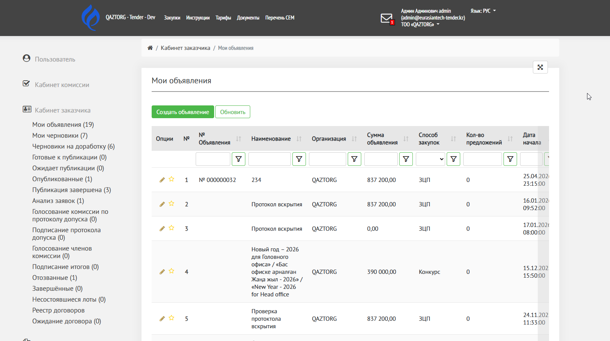
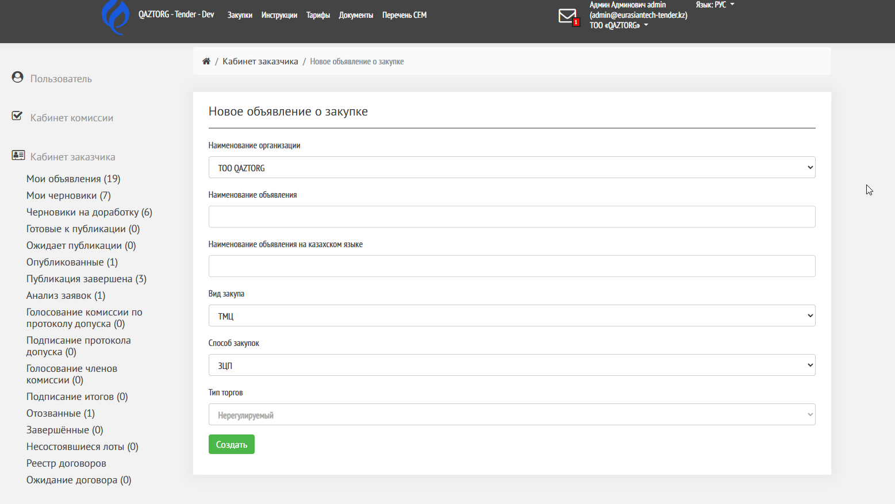

Данная инструкция описывает процесс создания нового объявления о закупке в кабинете заказчика.

---

## Как открыть страницу

1. Перейдите в раздел **«**[**Кабинет заказчика**](./../../../kabinet-zakazchika/_index)**»**

2. Выберите пункт **«Мои объявления»**

3. Нажмите кнопку **«Создать»** (или аналогичную)

{width=1621px height=909px}

Откроется форма **«Новое объявление о закупке»**.

{width=1557px height=877px}

---

## Описание полей формы

### 1\. Наименование организации

-  Выбирается из списка доступных организаций

-  Поле заполняется автоматически, если у пользователя одна организация

### 2\. Наименование объявления

-  Укажите название закупки на русском языке

-  Название должно быть понятным и отражать суть закупки

Пример:

:::quote 

Поставка компьютерной техники

:::

### 3\. Наименование объявления на казахском языке

-  Укажите перевод названия на казахском языке

-  Обязательное поле

### 4\. Вид закупа

-  Выбирается из списка

   -  ТМЦ

   -  Работы

   -  Услуги

   -  ТМЦ, Работы, Услуги

### 5\. Способ закупок

-  Определяет процедуру проведения закупки

-  Пример: **Тендер**

### 6\. Тип торгов

-  Указывается тип регулирования закупки - для Тендер это всегда Нерегулируемый

-  Пример: **Нерегулируемый**

---

После заполнения всех полей:

1. Нажмите кнопку **«Создать»**

2. Система создаст объявление и отроется страница заполнения объявления на статусе «Черновик»

---

## Результат

После создания объявления:

-  сохраняется в системе

-  попадает в раздел **«Черновики»**

-  доступно для дальнейшего заполнения

Перейдите к следующей статье [Черновик объявления](./../chernovik-obyavleniya/_index)