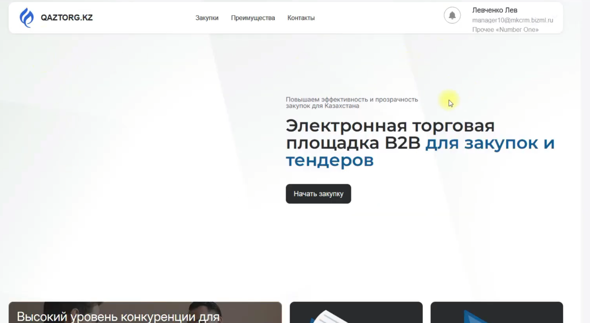
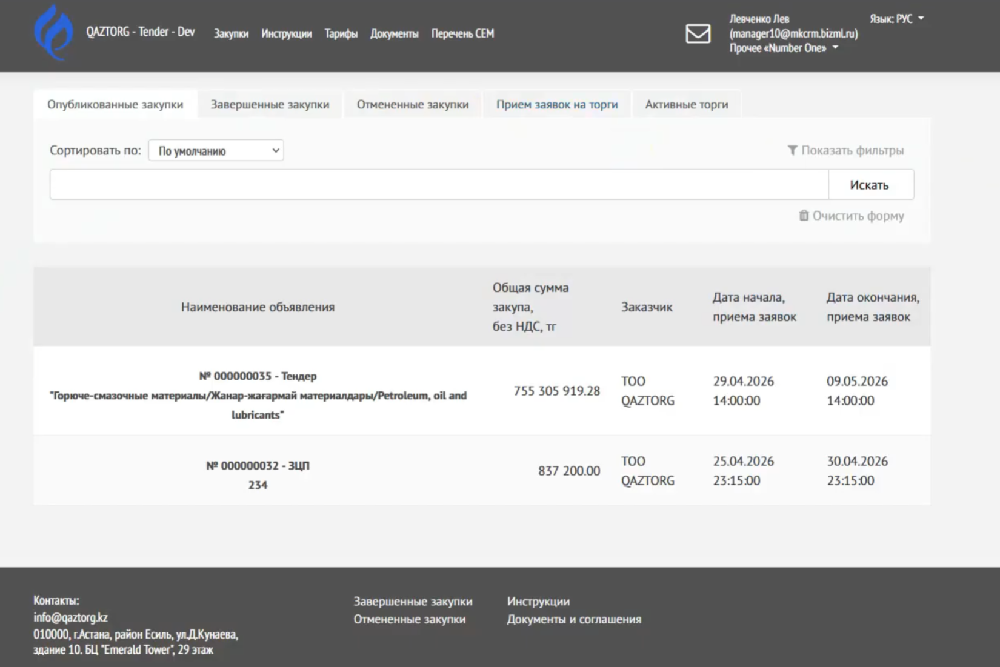
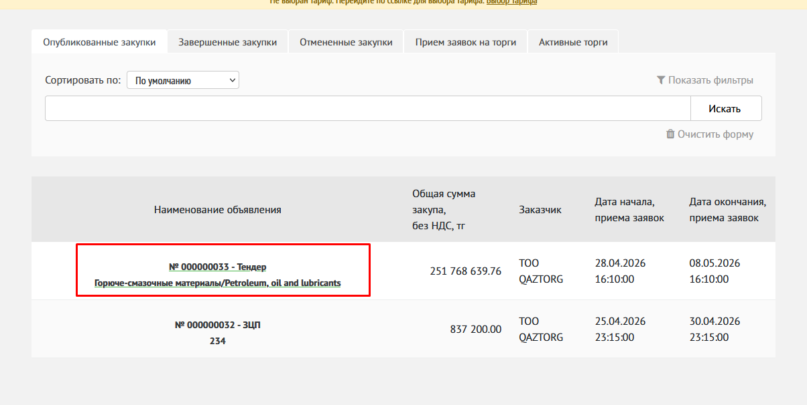
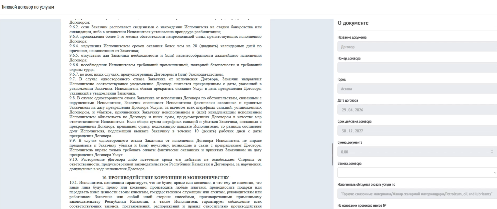
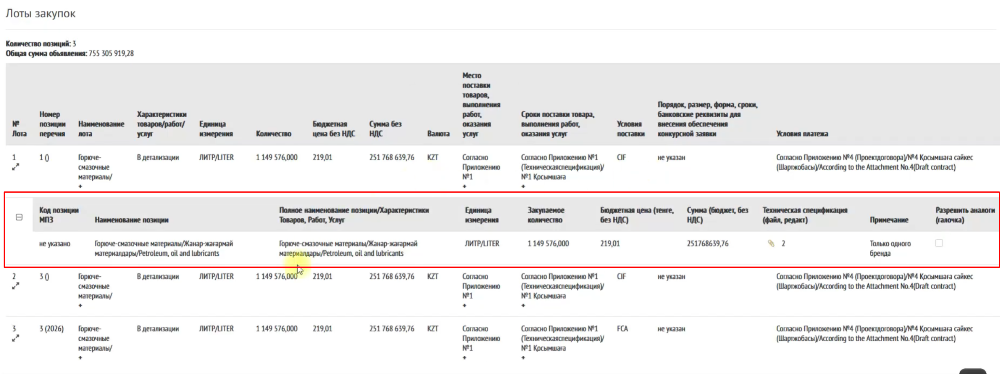
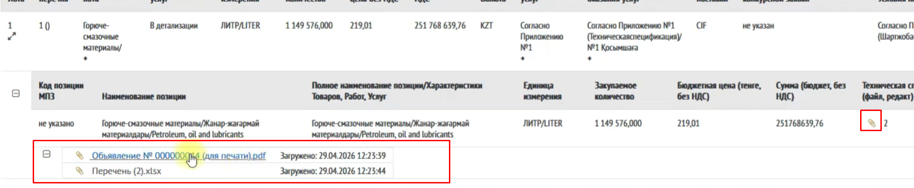
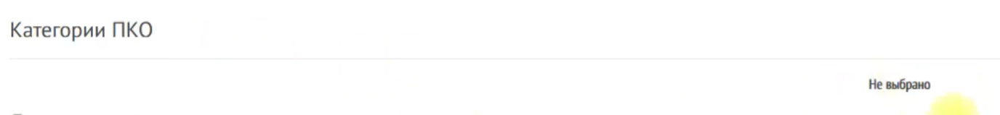
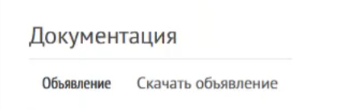

## Видео-инструкция 

[video:https://youtu.be/D7Ql7dI-0r8]

## Главная страница - лендинг

{width=2001px height=1098px}

В верхнем меню нажмите на кнопку «Закупки»

Открывается страница «Опубликованные закупки»

{width=1650px height=1101px}

## Переход к закупке

Для открытия объявления нажмите на его название.

{width=1204px height=606px}

---

## Ознакомление с объявлением

На странице объявления Вы увидите информацию

### Информация о закупке

-  Вид закупки

-  Контактные данные заказчика

### Информация об объявлении

-  Даты приема предложений

-  Срок действия

-  Допустимый демпинг

:::quote 

Если указан демпинг, нельзя подавать цену ниже установленного порога.

:::

{width=2548px height=1032px}

---

## Документы заказчика

В объявлении доступны:

-  Документы

-  Технические спецификации

-  Типовой договор (если приложен)

{width=2479px height=460px}

Для просмотра нажмите на иконку скрепки.

{width=2069px height=248px}

**Пример просмотра Типовой договор**

{width=2518px height=1061px}

---

## Лоты закупки

Отображается список лотов:

-  Номер

-  Наименование

-  Количество

-  Цена

Для просмотра деталей:

-  нажмите на лот

{width=2472px height=926px}

В детали лота отображаются дополнительные сведения, а также техническая спецификация по лотам, если она была вложена заказчиком.

Для просмотра тех.спецификации по лоту нажмите на иконку «скрепка»

{width=1985px height=410px}

---

## Категория ПКО

Если Заказчик указал категории, по которым будут допущены поставщики с предквалификационным отбором, то они будут перечислены.

По умолчанию Категории ПКО не выбраны

{width=1376px height=159px}

---

## Документация

На статусе объявления «Опубликовано» отображается подписанный заказчиком документ «Объявление».

{width=421px height=137px}

---

## Задать вопрос

Если модуль включен:

1\. Введите текст вопроса

2\. Нажмите **Отправить**